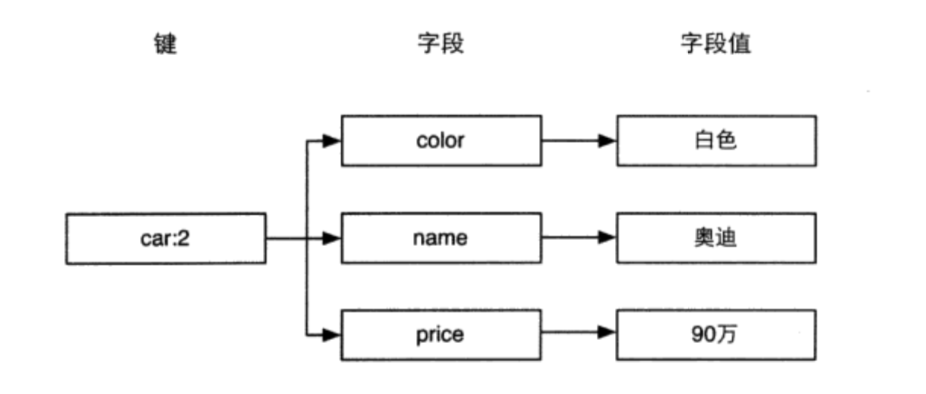

# 基础

## 启动
* 直接执行redis-server 可执行文件

## 停止
* redis 会自动根据配置文件执行持久化

```bash
redis-cli SHUTDOWN
kill redis_pid
```

## redis-cli
* 使用前需要在默认的/etc/redis.conf 中注释bind 和 设置protected-mode 为no
* 使用ping命令来测试是否连通

```bash
redis-server /etc/redis.conf
redis-cli -h 192.168.0.3 -p 6379
192.168.0.3:6379> ping
PONG
192.168.0.3:6379>
```

## 配置
* 启动的时候加载配置文件

```bash
redis-server /etc/redis.conf
```

## 多数据库
* redis 最多支持16个数据库,可以使用SELECT 来选择数据库,多个数据库之间并不是完全隔离的。FULSHALL 可以清空一个Redis 实例中的所有数据库中的数据，所以不用的应用最好启用不同的redis实例

```bash
192.168.0.3:6379> SELECT 2
OK
192.168.0.3:6379[2]> SELECT 0
OK
192.168.0.3:6379>
```
## 基本命令
* 获取符合规则的键名列表 keys pattern
* KEYS 命令会遍历Redis 中的所有键，数量较多的时候会影响性能

```bash
192.168.0.3:6379> set bar 1
OK
192.168.0.3:6379> KEYS *
1) "bar"
192.168.0.3:6379> KEYS b*
1) "bar"
```
* EXISTS 判断一个键是否存在

```bash
192.168.0.3:6379> EXISTS bar
(integer) 1
192.168.0.3:6379> EXISTS bar1
(integer) 0
```
* DEL 删除键
* DEL 不支持通配符,需要结合linxu管道和通配符执行删除

```bash
192.168.0.3:6379> DEL key bar
(integer) 1
192.168.0.3:6379> EXISTS bar
(integer) 0
192.168.0.3:6379>
➜  learn_pdf redis-cli -h 192.168.0.3 -p 6379 keys "bar*" |xargs redis-cli -h 192.168.0.3 -p 6379 DEL
(integer) 1
```
* TYPE 获取键的数据类型

```bash
192.168.0.3:6379> set bar 1
OK
192.168.0.3:6379> TYPE bar
string
```

## 字符串
* 可以存储任何形式的字符串,包括二进制数据。一个字符串类型键运行存储的数据最大容量是512MB。字符串是其他4种数据类型的基础。其他数据类型从某种角度来说只是组织字符串的形式不同
a

```bash
#写变量
192.168.0.3:6379> set key hello
OK
#读变量
192.168.0.3:6379> get key
"hello"
```
* 当存储的字符串是一个整数,可以使用INCR 让当前的键值递增。

```bash
192.168.0.3:6379> set foo lorem
OK
#键值不是整数会立即报错
192.168.0.3:6379> INCR foo
(error) ERR value is not an integer or out of range
192.168.0.3:6379> INCR num
(integer) 1
192.168.0.3:6379> INCR num
(integer) 2
192.168.0.3:6379>
```
* INCRBY 增加指定的整数

```bash
192.168.0.3:6379> INCRBY bar 2
(integer) 3
192.168.0.3:6379> INCRBY bar 3
(integer) 6

```
* DECRBY 减少指定的整数

```bash
192.168.0.3:6379> DECR bar
(integer) 5
192.168.0.3:6379> DECRBY bar 3
(integer) 2
```

* INCRBYFLOAT 可以指定增加的浮点数

```bash
192.168.0.3:6379> INCRBYFLOAT bar 2.7
"4.7"
```
* APPEND 向尾部增加值

```bash
192.168.0.3:6379> SET key hello
OK
192.168.0.3:6379> get key
"hello"
192.168.0.3:6379> APPEND key " world"
(integer) 11
192.168.0.3:6379> GET key
"hello world"
192.168.0.3:6379> del key
(integer) 1
192.168.0.3:6379> APPEND key " world"
(integer) 6
192.168.0.3:6379> get key
" world"
```
* SERLEN 获取字符串长度

```bash
192.168.0.3:6379> STRLEN key
(integer) 6
```
* MEGT MSET 同时获得/设置多个值

```bash
192.168.0.3:6379> MSET key1 v1 key2 b2
OK
192.168.0.3:6379> GET key1
"v1"
192.168.0.3:6379> MGET key1 key2
1) "v1"
2) "b2"
```
## 散列
* 散列类型适合存储对象,类似如下结构:
    

```bash
HSET key field value
HGET key field
HMSET key field value [field value]
HMGET key field [field ...]
HGETALL key
```
* HSET 命令的方便之处在于,不区分插入和更新操作,执行更新操作会返回0 执行插入操作会返回1,但键不存在时,会自动创建。
* SET 建立的键是字符串类型，HSET建立的键是散列类型

```bash
192.168.0.3:6379> HSET car price 500
(integer) 1
192.168.0.3:6379> HSET car name BMW
(integer) 1
192.168.0.3:6379> HGET car name
"BMW"
192.168.0.3:6379> HSET car price 5000
(integer) 0
#批量操作
192.168.0.3:6379> HMSET car price 500 name BMW
OK
192.168.0.3:6379> HMGET car price name
1) "500"
2) "BMW"
```
* 如果不知道键中有那些字段,可以使用 HGETALL

```bash
192.168.0.3:6379> HGETALL car
1) "price"
2) "500"
3) "name"
4) "BMW"
```
* HEXISTS 判断字段是否存在,存在返回1 不存在返回0

```bash
192.168.0.3:6379> HEXISTS car name
(integer) 1
192.168.0.3:6379> HEXISTS car name1
(integer) 0
```
* HSETNX 与 HSET 类似,区别在于如果字段已经存在,HSETNX 命令将不执行任何操作。(该命令是原子操作,不用担心竞态条件)

```bash
192.168.0.3:6379> HGETALL car
1) "price"
2) "500"
3) "name"
4) "BMW"
5) "name1"
6) "600"
192.168.0.3:6379> HSETNX car name 600
(integer) 0
192.168.0.3:6379> HGETALL car
1) "price"
2) "500"
3) "name"
4) "BMW"
5) "name1"
6) "600"
```
* HINCRBY 增加指定的整数 

```bash
192.168.0.3:6379> HINCRBY person score 60
(integer) 60
192.168.0.3:6379> HINCRBY person score 1
(integer) 61
192.168.0.3:6379> HGET person score
"61"
```
* HDEL 删除字段,返回值是被删除的字段数

```bash
192.168.0.3:6379> HDEL car price
(integer) 1
```

* HKEYS HVALS 只获取字段名或字段值

```bash
192.168.0.3:6379> HKEYS car
1) "name"
2) "name1"
192.168.0.3:6379> HVALS car
1) "BMW"
2) "600"
```
* HLEN 获取字段数量

```bash
192.168.0.3:6379> HLEN car
(integer) 2
```

## 列表类型
* 列表类型可以存储一个有序的字符串列表,常用的操作是向两端添加元素或者获得列表的某一个片段。内部是双向链表(double linked list)实现
* LPUSH 在列表左边增加元素
* RPUSH 在列表右边增加元素

```bash
172.16.16.199:6379> LPUSH numbers 1
(integer) 1
172.16.16.199:6379> LPUSH numbers 2 3
(integer) 3
172.16.16.199:6379> RPUSH numbers 0 -1
(integer) 5
#左边弹出元素
172.16.16.199:6379> LPOP numbers
"3"
#右边弹出元素
172.16.16.199:6379> RPOP numbers
"-1"
```
* LLEN 获取列表中的元素个数,时间复杂度为O(1)

```bash
172.16.16.199:6379> LLEN numbers
(integer) 3
```
* LRANGE key start stop 获取列表start-stop 索引之间的元素。返回的元素包含最右边的元素。

```bash
172.16.16.199:6379> LRANGE numbers 0 2
1) "2"
2) "1"
3) "0"
```
* LRANGE 同时也支持负索引,-1 表示右边第一个元素。-2 表示最右边第二个元素

```
172.16.16.199:6379> LRANGE numbers -2 -1
1) "1"
2) "0"
```
* LRANGE 如果stop 大于最右边的索引。则会返回最右边的元素

```bash
172.16.16.199:6379> LRANGE numbers 1 9999
1) "1"
2) "0"
```
* LREM key count value 删除列表中前count个值为value 的元素,返回值是实际删除的元素个数
    * 当count > 0 LREM 命令会从列表左边开始删除前count 个值为value的元素
    * 当count < 0 LREM 命令会从列表右边开始删除前count 个值为value的元素
    * 当count = 0 LREM 命令会删除所有值为value 的元素

```bash
172.16.16.199:6379> RPUSH numbers 2
(integer) 4
172.16.16.199:6379> LRANGE numbers 0 999
1) "2"
2) "1"
3) "0"
4) "2"
172.16.16.199:6379> LREM numbers 4 2
(integer) 2
172.16.16.199:6379> LRANGE numbers 0 999
1) "1"
2) "0"
```
* LINDEXi key index  根据索引获取元素值

```bash
172.16.16.199:6379> LINDEX numbers 0
"1"
```

* LSET key index value 按照索引赋值

```bash
172.16.16.199:6379> LSET numbers 0 2
OK
172.16.16.199:6379> LRANGE numbers 0 999
1) "2"
2) "0"
```
* KTRIM key start end 命令可以删除指定索引之外的元素 

```bash
172.16.16.199:6379> LRANGE numbers 0 999
1) "2"
2) "1"
3) "0"
4) "2"
5) "0"
172.16.16.199:6379> LTRIM numbers 0 1
OK
172.16.16.199:6379> LRANGE numbers 0 999
1) "2"
2) "1"
```
* LINSERT key BEFORE|AFTER pivot value 向列表中插入元素。该命令会从左到右查找值为pivot的元素。根据第二个来决定是插入到元素后面还是前面

```bash
172.16.16.199:6379> LRANGE numbers 0 999
1) "4"
2) "3"
3) "2"
4) "1"
5) "2"
6) "1"
172.16.16.199:6379> LINSERT numbers BEFORE 1 2
(integer) 7
172.16.16.199:6379> LRANGE numbers 0 999
1) "4"
2) "3"
3) "2"
4) "2"
5) "1"
6) "2"
7) "1"
```

## 集合类型
* 集合中的每个元素都是不同且无序
* SADD key member [member...] 增加元素

```bash
172.16.16.199:6379> SADD letters a
(integer) 1
172.16.16.199:6379> SADD letters a b  c
(integer) 2
```
* SREM key meneber [member...] 删除元素

```bash
172.16.16.199:6379> SREM letters c d
(integer) 1
```

* SMEMBERS key 获取集合中的所有元素

```bash
172.16.16.199:6379> SMEMBERS letters
1) "a"
2) "b"
```
* SISMEMBER key mumber 判断元素是否在集合中

```bash
172.16.16.199:6379> SISMEMBER letters a
(integer) 1
172.16.16.199:6379> SISMEMBER letters c
(integer) 0
```
* 集合间运算
    * SDIFF key [key ...] 对多个集合执行差集运算

    ```bash
    172.16.16.199:6379> SADD setA 1 2 3
    (integer) 3
    172.16.16.199:6379> SADD setB 2 3 4
    (integer) 3
    172.16.16.199:6379> SDIFF setA setB
    1) "1"
    172.16.16.199:6379> SDIFF setB setA
    1) "4"
    ```
    * SINTER 对多个集合执行交集运算

    ```bash
    172.16.16.199:6379> SINTER setA setB
    1) "2"
    2) "3"
    ```
    * SUNION 对多个集合执行并集运算

    ```bash
    172.16.16.199:6379> SUNION setA setB
    1) "1"
    2) "2"
    3) "3"
    4) "4"
    ```
* SCARD 获取集合中的元素个数

```bash
172.16.16.199:6379> SCARD setA
(integer) 3
```
* ```SDIFFSTORE destination key [key ...]  SINTERSTORE destination key [key ...] SUNIONSTORE destination key [key ...]``` 会直接把集合间的计算结果存储在destination 中

## 有序集合(sorted set) 
* ZADD key score member [score member...] ZADD命令用来向有序集合中加入一个元素和该元素的分数。如果该元素已经存在,会进行替换。

```bash
172.16.16.199:6379> ZADD scoreboard 89 TOM 67 Peter 100 David
(integer) 3
```
* ZSCORE 获取元素的分数

```bash
172.16.16.199:6379> ZSCORE scoreboard TOM
"89"
```
* ZRANGE key start stop [WITHSCORES] 从小到大返回索引之间的元素

```bash
172.16.16.199:6379> ZRANGE scoreboard 0 2
1) "Peter"
2) "TOM"
3) "David"
```
* ZINCRBY key increment member  可以增加一个元素的分数,返回增加后分数

```bash
172.16.16.199:6379> ZINCRBY scoreboard 20 TOM
"109"
172.16.16.199:6379> ZINCRBY scoreboard -20 TOM
"89"
```
* ZCARD 获取元素数量

```bash
172.16.16.199:6379> ZCARD scoreboard
(integer) 3
```
* ZREM 删除一个或多个元素

```bash
172.16.16.199:6379> ZREM scoreboard TOM
(integer) 1
```
* ZRANK key member 获取元素的排名

```bash
172.16.16.199:6379> ZRANGE scoreboard 0 -1 WITHSCORES
1) "Peter"
2) "67"
3) "David"
4) "100"
#排名为0
172.16.16.199:6379> ZRANK scoreboard Peter
(integer) 0
#排名为1
172.16.16.199:6379> ZRANK scoreboard David
(integer) 1
```
