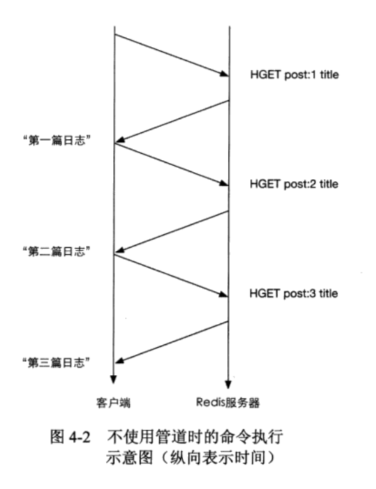

# 应用
* Redis 事物的原理是先将属于一个事物的命令发送给Redis,然后再让Redis依次执行这些命令
* 先用MULTI 启动事物,后续输入的命令都会被放入等待队列中。EXEC依次执行等待命令
* Redis 保证了一个事物中的所有命令要么执行,要么都不执行。还能保证一个事物内的命令依次执行而不被其他命令插入

```bash
172.16.16.199:6379> MULTI
OK
172.16.16.199:6379> SADD "user:1:following" 2
QUEUED
172.16.16.199:6379> SADD "user:2:followers" 1
QUEUED
172.16.16.199:6379> EXEC
1) (integer) 1
2) (integer) 1
```
## 错误处理
* 语法错误,如果有语法错误的指令,Redis一条指令也不会执行

```bash
172.16.16.199:6379> MULTI
OK
172.16.16.199:6379> SET key value
QUEUED
172.16.16.199:6379> SET key
(error) ERR wrong number of arguments for 'set' command
172.16.16.199:6379> EXEC
(error) EXECABORT Transaction discarded because of previous errors.
```

* 运行错误。这种错误在添加事物队列的时候是无法发现。执行事物的时候,没有错误的队列会继续执行
* 由于不具备Rollback 功能,所以需要手工处理数据回滚

```bash
172.16.16.199:6379> MULTI
OK
172.16.16.199:6379> SET key 1
QUEUED
172.16.16.199:6379> SADD key 2
QUEUED
172.16.16.199:6379> SET key 3
QUEUED
172.16.16.199:6379> EXEC
1) OK
2) (error) WRONGTYPE Operation against a key holding the wrong kind of value
3) OK
172.16.16.199:6379> GET key
"3"
```

## WATCH
* WATCH 命令可以监控一个或多个键,一旦其中有一个键被删除或者修改，之后的事物(MULTI)就不会执行。
* 事物执行前(EXEC) 修改了key的值。所以SET key 3没有执行。返回了空值

```bash
192.168.0.3:6379> WATCH key
OK
192.168.0.3:6379> SET key 2
OK
192.168.0.3:6379> GET key
"2"
192.168.0.3:6379> MULTI
OK
192.168.0.3:6379> SET key 3
QUEUED
192.168.0.3:6379> EXEC
(nil)
192.168.0.3:6379> GET key
"2"
```
## EXPIRE 生存时间
* EXPIRE 命令的使用方法为EXPIRE key seconds, seconds表示键的生存时间。单位是秒

```bash
192.168.0.3:6379> set session:29e3d uid1314
OK
192.168.0.3:6379> EXPIRE session:29e3d 900
(integer) 1
192.168.0.3:6379> del session:29e3d
(integer) 1
192.168.0.3:6379> EXPIRE session:29e3d 900
(integer) 0
```
* 使用TTL命令查看键还有多久会被删除

```bash
192.168.0.3:6379> TTL session:29e3d
(integer) 845
```
* PERSIST 取消键的TTL时间

```bash
192.168.0.3:6379> PERSIST session:29e3d
(integer) 1
192.168.0.3:6379> TTL session:29e3d
(integer) -1
```
## 设定maxmemory
* 通过设定配置文件的maxmemory 参数可以限制Redis最大可用内存大小(单位是字节),当超出这个限制,Redis会根据maxmemory-policy 参数指定的策略来删除不需要的键。
    * __LRU__ (Least Recently Used): 最近最少使用键
    * volatile-lru:  使用LRU算法删除一个键(只对设置了TTL的键)
    * allkeys-lru: 使用LRU算法删除一个键
    * volatile-random: 随机删除一个键(只对设置了TTL的键)
    * allkeys-random: 随机删除一个键 
    * volatile-ttl: 删除生存时间最近的一个键
    * noeviction: 不删除键,只返回错误

## SORT 排序
* SORT 可以对列表 集合 有序集合 排序

```bash
192.168.0.3:6379> LPUSH mylist 3 4 3 1 6 9
(integer) 6
192.168.0.3:6379> SORT mylist
1) "1"
2) "3"
3) "3"
4) "4"
5) "6"
6) "9"
192.168.0.3:6379> ZADD myzset 50 2 40 3 20 1 60 5
(integer) 4
192.168.0.3:6379> SORT myzset
1) "1"
2) "2"
3) "3"
4) "5"
```
* SORT 命令之后加上DESC 可以按照从小到大排序

```bash
192.168.0.3:6379> SORT mylist DESC
1) "9"
2) "6"
3) "4"
4) "3"
5) "3"
6) "1"
```

## 使用Redis实现任务队列
* 生产者不断的LPUSH 队列, 消费者RPOP队列就可以实现任务队列
* 结合BRPOP 命令可以实现优先级队列

## 发布/订阅模式(publish/subscribe)
* 订阅者可以订阅一个或若干个频道(channel),而发布者可以指定频道发送消息，所有订阅此频道的订阅者都会收到此消息
* PUBLISH channel message 发布者向频道发送消息

```bash
#返回值表示接收到消息的订阅者
192.168.139.136:6379> PUBLISH channel1.1 hi
(integer) 0
```
* 订阅频道的命令是 SUBSRIBE 可以同时订阅多个频道
* SUBSRIBE channel [channel...]

```
192.168.139.136:6379> SUBSCRIBE channel1.1
Reading messages... (press Ctrl-C to quit)
1) "subscribe"#表示订阅成功 类似初始化
2) "channel1.1" #表示订阅成功的频道名称
3) (integer) 1#当前客户端订阅的频道数量
1) "message"#消息回复
2) "channel1.1"
3) "hi"#消息内容
```
* UNSUBSCRIBE channel 取消订阅

```bash
192.168.139.136:6379> UNSUBSCRIBE channel1.1
1) "unsubscribe"
2) "channel1.1"
3) (integer) 0
```

* 使用PSUBSCRIBE 指定订阅规则

```
➜  Redis redis-cli -h 192.168.139.136 -p 6379
192.168.139.136:6379> PSUBSCRIBE channel.?*
Reading messages... (press Ctrl-C to quit)
1) "psubscribe"
2) "channel.?*"#适应的订阅规则
3) (integer) 1
1) "pmessage"
2) "channel.?*"
3) "channel.1"#实际订阅到的频道
4) "hi!"
```
## 管道(Pipline)
* 在执行多条命令的时候,上一条命令需要等待下一条命令执行完成(命令之前不相互依赖),如图:


* 使用管道可以一次性发送多条命令并在执行完成后一次性返回结果。减少客户端与服务器的通信次数节省资源。如图


