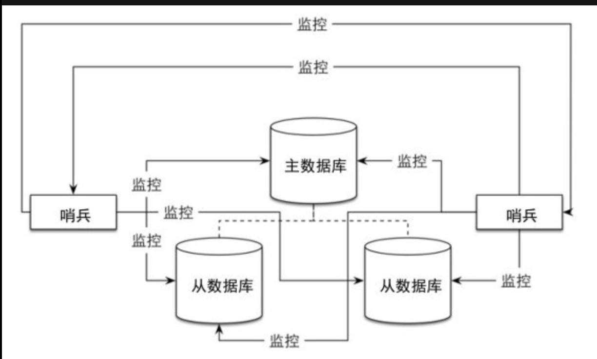

# 集群
* 复制 replicaton
* 哨兵 sentinel 
* 集群 cluster

## 复制
* Redis 提供了replication功能,自动将数据同步到其他数据库。
* 配置
    * 主数据库(master),从数据库(slave)主数据库可以进行读写操作，从数据库只能进行读操作。同时接受主数据库同步过来的数据。
    * 只要在从数据库中修改 slaveof <masterip> <masterport> 属性就可以使用复制功能
    * 默认情况下从数据库是只读的,可以设置 slave-read-only 为no 使从数据库可写。但对从数据库可写不会同步数据到其他数据库,一般不使用。
    * 演示

    ```bash
    #启动从数据库,监听主数据库的6379端口
    redis-server --port 6380 --slaveof 127.0.0.1 6379
    ➜  ~ redis-cli -h 192.168.139.136 -p 6379 #master
    192.168.139.136:6379> SET foo bar
    OK
    ➜  ~ redis-cli -h 192.168.139.136 -p 6380 #slave
    192.168.139.136:6380> INFO reliication
    192.168.139.136:6380> GET foo
    "bar"
    192.168.139.136:6380> SET FOO hi#默认情况slave是只读的,修改会报错
    (error) READONLY You can't write against a read only slave.
    ```
* 原理:当从数据里启动后,会向主数据库发送SYNC命令,主数据库收到命令后,开始在后台保存快照(RDB),并将接受到的命令缓存起来。当快照完成后,redis会将快照和所有缓存命令发送给从数据库,从而保证主从一致。从数据库会增量复制主数据库的内容

* 通过复制可以实现读写分离，这种一主多从很适合读多写少的场景。
* 主数据库崩溃后，手工通过从数据库恢复主数据库数据步骤:
    * 在从数据中使用SLAVEOF NO ONE 命令将从数据库提升成主数据库继续服务。
    * 启动之前奔溃的主数据库,然后使用SLAVEOF 命令将其设置成新的主数据库的从数据库既可将数据同步过来。

## 哨兵
* 哨兵的作用就是监控Redis系统的运行状态
    * 监控主数据库和从数据库是否正常运行
    * 主数据库出现故障自动将从数据转换为主数据库
    * 哨兵之间可以相互监控
    
* 使用
    * 配置文件 sentinel.conf

    ```bash
    #sentinel.conf
    sentinel monitor master 127.0.0.1 6379 1 #master主数据库名字 ip 端口
    #启动
	redis-sentinel sentinel.conf
    ```
    * 杀死主数据库,哨兵日志

    ```bash
    #表示监控到主数据库停止服务
    86533:X 07 Aug 08:01:08.742 # +sdown master master 127.0.0.1 6379
    86533:X 07 Aug 08:01:08.743 # +odown master master 127.0.0.1 6379 #quorum 1/1

    86533:X 07 Aug 08:01:08.743 # +new-epoch 1
    #开始故障恢复
    86533:X 07 Aug 08:01:08.743 # +try-failover master master 127.0.0.1 6379
    86533:X 07 Aug 08:01:08.754 # +vote-for-leader 50c166d2b570857cf006a0b3e39fb9796f12e4ad 1
    86533:X 07 Aug 08:01:08.754 # +elected-leader master master 127.0.0.1 6379
    86533:X 07 Aug 08:01:08.754 # +failover-state-select-slave master master 127.0.0.1 6379
    86533:X 07 Aug 08:01:08.809 # +selected-slave slave 127.0.0.1:6380 127.0.0.1 6380 @ master 127.0.0.1 6379
    86533:X 07 Aug 08:01:08.809 * +failover-state-send-slaveof-noone slave 127.0.0.1:6380 127.0.0.1 6380 @ master 127.0.0.1 6379
    86533:X 07 Aug 08:01:08.876 * +failover-state-wait-promotion slave 127.0.0.1:6380 127.0.0.1 6380 @ master 127.0.0.1 6379
    86533:X 07 Aug 08:01:09.818 # +promoted-slave slave 127.0.0.1:6380 127.0.0.1 6380 @ master 127.0.0.1 6379
    86533:X 07 Aug 08:01:09.818 # +failover-state-reconf-slaves master master 127.0.0.1 6379
    86533:X 07 Aug 08:01:09.897 * +slave-reconf-sent slave 127.0.0.1:6381 127.0.0.1 6381 @ master 127.0.0.1 6379
    86533:X 07 Aug 08:01:10.451 * +slave-reconf-inprog slave 127.0.0.1:6381 127.0.0.1 6381 @ master 127.0.0.1 6379
    86533:X 07 Aug 08:01:10.451 * +slave-reconf-done slave 127.0.0.1:6381 127.0.0.1 6381 @ master 127.0.0.1 6379
    #故障恢复完毕
    86533:X 07 Aug 08:01:10.551 # +failover-end master master 127.0.0.1 6379
    #表示主数据库从6379迁移到6380
    86533:X 07 Aug 08:01:10.551 # +switch-master master 127.0.0.1 6379 127.0.0.1 6380
    #列出新的从数据库6379 6381
    86533:X 07 Aug 08:01:10.551 * +slave slave 127.0.0.1:6381 127.0.0.1 6381 @ master 127.0.0.1 6380
    86533:X 07 Aug 08:01:40.598 # +sdown slave 127.0.0.1:6379 127.0.0.1 6379 @ master 127.0.0.1 6380
    ```

    ```bash
    #主数据库
    192.168.139.136:6380> INFO replication
    # Replication
    role:master
    connected_slaves:1
    slave0:ip=127.0.0.1,port=6381,state=online,offset=41595,lag=0
    master_repl_offset:41726
    repl_backlog_active:1
    repl_backlog_size:1048576
    repl_backlog_first_byte_offset:2
    repl_backlog_histlen:41725
    #从数据库
    192.168.139.136:6381> INFO replication
    # Replication
    role:slave
    master_host:127.0.0.1
    master_port:6380
    master_link_status:up
    master_last_io_seconds_ago:2
    master_sync_in_progress:0
    slave_repl_offset:53375
    slave_priority:100
    slave_read_only:1
    connected_slaves:0
    master_repl_offset:0
    repl_backlog_active:0
    repl_backlog_size:1048576
    repl_backlog_first_byte_offset:0
    repl_backlog_histlen:0
    ```
    * 主数据库恢复,哨兵监控到,添加一个从数据库(6379)

    ```bash
    86533:X 07 Aug 08:19:26.650 # -sdown slave 127.0.0.1:6379 127.0.0.1 6379 @ master 127.0.0.1 6380
    86533:X 07 Aug 08:19:36.596 * +convert-to-slave slave 127.0.0.1:6379 127.0.0.1 6379 @ master 127.0.0.1 6380
    ```
## 集群
* 即使使用哨兵,集群中的每个数据库依然存有集群中的所有数据,从而导致集群存储总数受限于最小可用存储内存,形成木桶效应。
* 配置集群,只需将每个节点的cluster-enabled配置选项打开,每个集群至少需要3个主数据库才能正常运行
* 3主3从的集群系统例子:
    * 1.redis.conf 配置文件,1.需要设置port 2.cluster-enabled yes(集群开启) cluster-config-fule nodes.conf(集群状态,每个节点的文件名需不同)
    * 2.使用redis-cli 的INFO cluster 判断个节点状

    ```bash
    (py36) ➜  code redis-cli -p 6381
    127.0.0.1:6381> INfo cluster
    # Cluster
    cluster_enabled:1
    ```
    * 3.使用redis-cli启动集群,create 表示初始化集群 --cluster-replicas 表示每个主数据库拥有的从数据库个数,整个集群共有3个主数据库,3个从数据库

    ```bash
	➜  src redis-cli --cluster create 127.0.0.1:6380 127.0.0.1:6381 127.0.0.1:6382 127.0.0.1:6383 127.0.
	0.1:6384 127.0.0.1:6385 --cluster-replicas 1
	```
    * 4.启动完成后,使用redis-cli 连接任一节点,CLUSTER NODES 查看集群信息,可以看到3主3从的配置
    
    ```bash
    (py36) ➜  ~ redis-cli -p 6380
    127.0.0.1:6380> CLUSTER NODES
    f10aa02917f157d8a925bda72db963043f45f108 127.0.0.1:6380@16380 myself,master - 0 1565275572000 1 connected 0-5460
    addc7d24a68af034d40006d20832ab99a148201e 127.0.0.1:6384@16384 slave f10aa02917f157d8a925bda72db96304
    3f45f108 0 1565275573604 5 connected
    daf5a0e3249fde4296f120faee4b017213edef4c 127.0.0.1:6382@16382 master - 0 1565275574643 3 connected 10923-16383
    938b8cfe54aa52b9b22fc43b00887be7954e9860 127.0.0.1:6383@16383 slave daf5a0e3249fde4296f120faee4b0172
    13edef4c 0 1565275573000 4 connected
    5456ee3a7013360636def2bac3ca28dcb44cb105 127.0.0.1:6385@16385 slave a3936dd7769f42c7e94f5514cc8e7437
    e05a216e 0 1565275574000 6 connected
    a3936dd7769f42c7e94f5514cc8e7437e05a216e 127.0.0.1:6381@16381 master - 0 1565275573000 2 connected 5
    461-10922
    ```
* 节点的增加:增加节点只需要使用命令 CLUSTER MEET ip port ip和port是集群中任一节点的地址和端口号。
* 插槽的分配:新加入的节点,要么使用cluster replcate 命令复制每个主数据库来以从数据库的形式运行。要么向集群中申请分配插槽(slot)来以主数据库的形式来运行
    * 插槽之前没有被分配过,现在想分配给指定的节点,使用 ``` CLUSTER ADDSLOTS slot1 slot2 ```, 查看现有插槽分配情况

    ```bash
	127.0.0.1:6380> CLUSTER SLOTS
	1) 1) (integer) 0 #插槽的开始节点和结束节点
	   2) (integer) 5460
		#负责该插槽的节点
	   3) 1) "127.0.0.1"
		  2) (integer) 6380
		  3) "f10aa02917f157d8a925bda72db963043f45f108"
	   4) 1) "127.0.0.1"
		  2) (integer) 6384
		  3) "addc7d24a68af034d40006d20832ab99a148201e"
	2) 1) (integer) 10923
	   2) (integer) 16383
	   3) 1) "127.0.0.1"
		  2) (integer) 6382
		  3) "daf5a0e3249fde4296f120faee4b017213edef4c"
	   4) 1) "127.0.0.1"
		  2) (integer) 6383
		  3) "938b8cfe54aa52b9b22fc43b00887be7954e9860"
	3) 1) (integer) 5461
	   2) (integer) 10922
	   3) 1) "127.0.0.1"
		  2) (integer) 6381
		  3) "a3936dd7769f42c7e94f5514cc8e7437e05a216e"
	   4) 1) "127.0.0.1"
		  2) (integer) 6385
		  3) "5456ee3a7013360636def2bac3ca28dcb44cb105"
    ```
    * 插槽之前被分配过,现在想移动到指定节点 TODO


    
