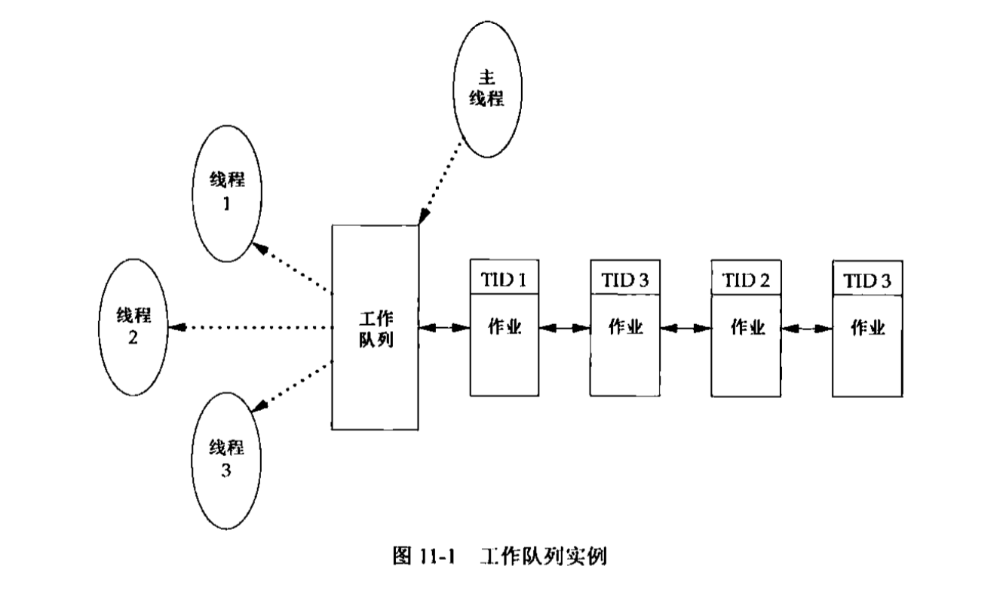
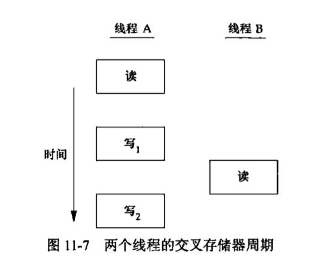
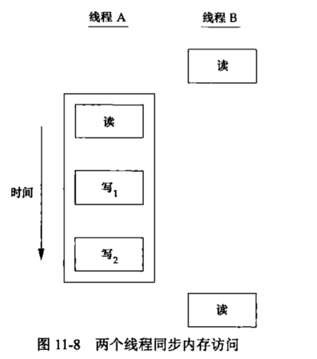

# 线程

## 线程概念
* 典型的unix进程可以看成只有一个__控制线程__:一个进程在某一时刻只能做一件事。有了多个控制线程后，在程序设计时，就可以把进程设计成某一时刻能够做不止一件事，每个线程处理各种独立的任务。
* 线程优点:
    * 通过为每种事件类型分配单独的处理线程，可以简化处理异步事件的代码。每个线程在进行事件处理时可以采用__同步编程模式__,同步编程模式比一般编程模式简单得多。
    * 多个进程必须使用操作系统提供的复杂机制才能实现内存和文件描述符的共享。而多个线程自动地可以访问相同的存储地址和文件描述符。
    * 有些问题可以分解从而提高整个程序的吞吐量。相互__独立__的任务可以交叉进行,只需要为每个任务分配一个单独的线程。
* 每个线程都包含有表示执行环境所必须的信息,其中包括进程中标识线程的__线程ID,一组寄存器值，栈，调度优先值和策略,信号屏蔽字，errno变量,和线程私有数据__。一个进程的所有信息，对该进程的所有线程都是共享的,包括可执行程序的代码，程序的全局内存和堆内存,栈以及文件描述符。

## 线程标识
* 进程ID在整个系统中是唯一的，但线程ID不同，线程ID只有在它所属的__进程上下文__中才有意义。
* 工作队列实例 
* 主线程把新的作业(task)放到一个工作队列中，由3个工作线程组成的线程池从队列中移出作业。主线程不允许每个线程任意处理队列顶端的作业，而是由主线程控制作业的分配，主线程会在每个待处理作业的结构中放置处理该作业的线程ID，每个工作线程只能移出标有自己线程ID的作业
    

## 线程创建
* 在程序开始运行时，它也是以单进程中的单个__控制线程__启动的。在创建多个控制线程以前，程序的行为与传统的进程并没有什么区别,新增的线程可以通过调用__pthread_create__函数创建。
* 线程创建时并不能保证哪个线程会先运行:是新建的线程，还是调用线程。新创建的线程可以访问进程的__地址空间__，并且继承调用线程的浮点环境和信号屏蔽字,但是该线程的挂起信号集会被清除。


    ```c
    /*
    * example:创建线程，打印进程ID,新线程ID和初始线程的线程ID
        * 实例代码中,主线程需要__休眠__，如果主线程不休眠，他就可能退出，这样新线程还没有机会运行，整个进程可能就已经终止,所以sleep(1)
        * 新线程是通过__pthread_self__ 函数获取子线程的线程ID,而不是从共享内存中读取。或者从线程的启动例程中以参数的形式接收到(当pthread_create成功返回时，新创建的线程的线程ID会被设置成tidp指向的内存单元)。如果新线程在pthread_create调用完成之前就结束了，那么无法在tidp中正确拿到线程ID
    */

    #include "apue.h"
    #include <pthread.h>

    pthread_t ntid;

    void
    printids(const char *s)
    {
        pid_t pid;
        pthread_t tid;
        
        pid = getpid();
        tid = pthread_self();
        printf("%s pid %lu tid %lu (0x%lx)\n", s, (unsigned long)pid, (unsigned long)tid,(unsigned long)tid);
    }

    void *
    thr_fn(void *arg)
    {
        //子线程
        printids("new thread:");
        return ((void *)0);

    }

    int 
    main(void)
    {
        int err;
        err = pthread_create(&ntid, NULL, thr_fn, NULL);
        if (err != 0)
            err_exit(err, "can't create thread");
        //控制线程
        printids("main thread:");
        sleep(1);
        exit(0);
    }

    ```
## 线程终止

* 如果默认动作是终止进程，那么，发送到线程的信号就会终止整个进程
* 单个线程可以通过3种方式退出,可以在不终止整个进程的情况下，停止他的控制流
    * 线程可以简单的从启动例程中返回，返回值是线程的退出码
    * 线程可以被同一进程中的其他线程取消
    * 线程调用pthread_exit

    ```c
    #include <pthread>
    void pthread_exit(void *rval_ptr)    
    int pthread_join(pthread_t thread, void **rval_ptr) 
    ```

    * pthread_join 使调用线程一直阻塞，直到指定的线程(thread)返回或退出。
    * 可以看到，当一个线程从简单的启动例程返回或调用pthread_exit退出，进程中的其他线程，可以通过调用pthread_join函数获取该线程的退出状态


    ```c
    #include "apue.h"
    #include <pthread.h>

    void *
    thr_fn1(void *arg)
    {
        printf("thread 1 returning\n");
        sleep(1);
        return ((void *)1);
    }

    void *
    thr_fn2(void *arg)
    {
        printf("thread 2 exiting\n");
        pthread_exit((void *)2);
    }

    int 
    main(void)
    {
        int err;
        pthread_t tid1,tid2;
        void *tret;

        err = pthread_create(&tid1, NULL, thr_fn1, NULL);
        if (err != 0)
            err_exit(err, "can't create thread 1");
        err = pthread_create(&tid2, NULL, thr_fn2, NULL);
        if (err != 0)
            err_exit(err, "can't create thread 2");
        err = pthread_join(tid1, &tret);
        if (err != 0)
            err_exit(err, "can't join with thread 1");
        printf("thread 1 exit code %ld\n", (long)tret);
        err = pthread_join(tid2, &tret);
        if (err != 0)
            err_exit(err, "can't join with thread 2");
        printf("thread 2 exit code %ld\n", (long)tret);
        exit(0);

    }
    out:
    ➜  lesson_11 ./a.out
    thread 1 returning
    thread 2 exiting
    thread 1 exit code 1
    thread 2 exit code 2
    ```
    
    * 用自动变量(分配在栈上)作为pthread_exit的参数时出现的问题
		* 当主线程访问这个结构时，结构的内容(在线程tid2的栈上分配的)已经改变了。

    ```c
    #include "apue.h"
    #include <pthread.h>

    struct foo {
        int a,b,c,d;
    };

    void 
    printfoo(const char *s, const struct foo *fp)
    {
        printf("%s", s);
        printf(" structure at 0x%lx\n", (unsigned long)fp);
        printf(" foo.a = %d\n", fp->a);
        printf(" foo.b = %d\n", fp->b);
        printf(" foo.c = %d\n", fp->c);
        printf(" foo.d = %d\n", fp->d);

    }

    void *
    thr_fn1(void *arg)
    {
        struct foo foo = {1,2,3,4};
        printfoo("thread 1:\n", &foo);
        pthread_exit((void *)&foo);
    }

    void *
    thr_fn2(void *arg)
    {
        printf("thread 2:ID is %lu\n", (unsigned long)pthread_self());
        pthread_exit((void*)0);
    }

    int
    main(void)
    {
        int err;
        pthread_t tid1,tid2;
        struct foo *fp;

        err = pthread_create(&tid1, NULL, thr_fn1, NULL);
        if (err != 0)
            err_exit(err, "can't create thread 1");
        err = pthread_join(tid1, (void *)&fp);
        if (err != 0)
            err_exit(err, "can't join with thread 1");

        sleep(1);
        printf("parent starting second thread\n");
        err = pthread_create(&tid2, NULL, thr_fn2,NULL);
        if (err != 0)
            err_exit(err, "can't create thread 2");

        sleep(1);
        printfoo("parent:\n", fp);
        exit(0);
    }
    out:
	thread 1:
	structure at 0x7000065f9ef0
	foo.a = 1
	foo.b = 2
	foo.c = 3
	foo.d = 4
	parent starting second thread
	thread 2:ID is 123145409241088
	parent:
	 structure at 0x7000065f9ef0
	[1]    91252 segmentation fault  ./a.out
    ```

	* 线程可以通过pthread_cancel 函数来请求取消同一进程中的其他进程,该函数会使得由tif标识的线程的行为表现为如同调用了参数为PTHREAD_CANCELED 的pthread_exit 函数。线程可以选择忽略取消或者控制如何被取消。该函数并不等待线程终止,它仅仅提出请求。

    ```c
    #include <pthread.h>
    int pthread_cancel(pthread_t tid)
    ```

    * 线程的退出可以调用__线程清理处理程序__,一个线程可以建立多个处理程序。程序注册在栈中，执行顺序与注册时相反。

    ```c
    #include "apue.h"
    #include <pthread.h>
    void pthread_cleanup_push(void (*rtn)(void *), void *arg)
    void pthread_cleanup_pop(int execute)
    ```

    ```c
    #include "apue.h"
    #include <pthread.h>

    void
    cleanup(void *arg)
    {
        printf("cleanup: %s\n",(char *)arg);
    }

    void *
    thr_fn1(void *arg)
    {
        printf("thread 1 start\n");
        pthread_cleanup_push(cleanup,"thread 1 first handler");
        pthread_cleanup_push(cleanup,"thread 2 second handler");
        printf("thread 1 push complete\n");
        //使用return正常返回不会触发cleau_up函数
        if (arg)
            return ((void *)1);
        pthread_cleanup_pop(0);
        pthread_cleanup_pop(0);
        return ((void *)1);
    }

    void *
    thr_fn2(void *arg)
    {
        printf("thread 2 start\n");
        pthread_cleanup_push(cleanup,"thread 1 first handler");
        pthread_cleanup_push(cleanup,"thread 2 second handler");
        printf("thread 2 push complete\n");
        //使用pthread_exit会触发cleau_up函数
        if (arg)
            pthread_exit((void *)2);
        pthread_cleanup_pop(0);
        pthread_cleanup_pop(0);
        pthread_exit((void *)2);
    }

    int 
    main(void)
    {
        int err;
        pthread_t tid1,tid2;
        void *tret;

        err = pthread_create(&tid1, NULL, thr_fn1,(void *)1);
        if (err != 0)
            err_exit(err,"can't create thread 1");

        err = pthread_create(&tid2, NULL, thr_fn2,(void *)1);
        if (err != 0)
            err_exit(err,"can't create thread 2");

        err = pthread_join(tid1, &tret);
        if (err != 0)
            err_exit(err,"can't join with thread 1");
        err = pthread_join(tid2, &tret);
        if (err != 0)
            err_exit(err,"can't join with thread 2");

        printf("thread 2 exit code %ld\n",(long)tret);
        exit(0);

    }
    out:
    thread 2 start
    thread 2 push complete
    thread 1 start
    thread 1 push complete
    cleanup: thread 2 second handler
    cleanup: thread 1 first handler
    thread 2 exit code 2
    ```

    * 线程函数和进程函数的相似之处

        * fork             pthread_create      创建新的控制流                
        * exit             pthread_exit        从现有控制流中退出            
        * waitpid          pthread_join        从控制流中得到退出状态        
        * atexit           pthread_cancel_push 注册在退出控制流时调用的函数  
        * getpid           pthread_self        获取控制流的ID                
        * abort            pthread_cancel      请求控制流的非正常退出        

    * 默认情况下，线程的终止状态会保存，直到对该线程调用__pthread_join__。如果线程已经被__分离__，线程底层存储资源可以在线程终止时立即被收回。

## 线程同步
* 如果每个__控制线程__使用的变量都是其他线程不会读取和修改的或者变量是只读的，多个线程同时读取该变量就不会有一致性问题。但是当一个线程可以修改变量，其他线程也可以读取或修改，我们就需要对线程进行同步，确保不会访问到无效的值。
* 下图描述了线程读取相同变量的例子,线程A读取变量，然后给这个变量赋予一个新的数值，但写操作需要两个存储器周期。当线程B在这两个存储器写周期中间读取这个变量时，就会得到不一样的值。
    
* 为了解决上述问题，线程不得不使用锁,同一时间只允许一个线程访问变量。如果线程B希望读取变量，首先要获得锁。线程A更新变量时，也需要获取这把锁。线程B在线程A释放锁以前就不能读取变量。
    

* __互斥量__:
    * 可以使用pthread的互斥接口来保护数据，确保同一时间只有一个线程访问数据。__互斥量(mutex)__从本质上说是一把__锁__，在访问共享资源前__加锁__，在访问完成后__释放__锁。在对互斥量加锁后，任何其他试图再次对互斥量加锁的线程都会被__阻塞__直到当前线程释放该互斥锁。如果释放互斥量时有一个以上的线程阻塞，那么所有该阻塞线程都会变成可运行状态，第一个变为运行的线程就可以对互斥量加锁,其他线程看到互斥量依然锁着，只能再次回去等待。
    * 对互斥量加锁，需要调用__pthread_mutex_lock__,如果互斥量已经上锁，调用线程将阻塞直到互斥量被解锁。对互斥量解锁，需要调用__pthread_mutex_unlock__,如果不希望线程阻塞，可以尝试使用__pthread_mutex_trylock__加锁,如果调用时，互斥量处于未锁住状态，那么该函数将锁住互斥量，返回0。否者返回__EBUSY__

    ```c
    #include <pthread.h>
    int pthread_mutex_lock(pthread_mutex_t *mutex)
    int pthread_mutex_trylock(pthread_mutex_t *mutex)
    int pthread_mutex_unlock(pthread_mutex_t *mutex)
    ```

* __避免死锁__
    * 死锁的产生:
        * 如果线程试图对同一个互斥量加锁两次，那么它自身就会陷入__死锁__状态。
        * 程序中使用一个以上的互斥量时，如果允许一个线程一直占有第一个互斥量，并且在视图锁住第二个互斥量时处于__阻塞__状态，但是拥有第二个互斥量的线程也在视图锁住第一个互斥量。因为两个线程都在__相互请求__另一个线程拥有的资源，所以两个线程都无法向前运行，于是产生了__死锁__。
    * 避免死锁:
        * 控制锁的获取顺序(代码可能比较复杂)
        * 先释放占有的锁,然后过一段时间再次尝试,可以使用pthread_mutex_trylock函数(如果已经占有某些锁,并且trylock函数获取锁失败,可以先清理已经占用的锁,再次尝试)
        * __pthread_mutex_timelock__ 对互斥量加锁，达到超时时间,不会对互斥量进行加锁,而是返回错误码
    ```
    #include <pthread.h>
    #include <time.h>
    int pthread_mutex_timelock(pthread_mutex_t *restrict mutex,const struct timespec *restrict tsptr)
    ```

    ```c
    /*避免永久阻塞*/
    #include "apue.h"
    #include <pthread.h>

    int
    main(void)
    {
        int err;
        struct timespec tout;
        struct tm *tmp;
        char buf[64];
        pthread_mutex_t lock = PTHREAD_MUTEX_INITIALIZER;

        pthread_mutex_lock(&lock);
        printf("mutex is locked\n");
        clock_gettime(CLOCK_REALTIME, &tout);
        tmp = localtime(&tout.tv_sec);
        strftime(buf, sizeof(buf), "%r", tmp);
        printf("current time is %s\n", buf);
        tout.tv_sec += 10;	/* 10 seconds from now */
        /* caution: this could lead to deadlock */
        err = pthread_mutex_timedlock(&lock, &tout);
        clock_gettime(CLOCK_REALTIME, &tout);
        tmp = localtime(&tout.tv_sec);
        strftime(buf, sizeof(buf), "%r", tmp);
        printf("the time is now %s\n", buf);
        if (err == 0)
            printf("mutex locked again!\n");
        else
            printf("can't lock mutex again: %s\n", strerror(err));
        exit(0);
    }
    out:
    [dev@dev-centos6 lesson_11]$ ./a.out
    mutex is locked
    current time is 09:51:56 PM
    the time is now 09:52:06 PM
    can't lock mutex again: Connection timed out
    ```

* __读写锁__
    * __读写锁__与互斥量类似
        * 互斥量:锁住状态，不加锁状态。而且一次只有一个线程可以对其加锁。
        * 读写锁可以有三种状态。__读模式加锁状态__，__写模式加锁状态__，__不加锁状态__。一次只有一个线程可以占有写模式的读写锁，但是多个线程可以同时占有读模式的读写锁。
    * 运行机制
        * 当读写锁是__写加锁__状态，在这个锁被解锁之前，所有试图对这个锁加锁的线程都会被阻塞。
        * 当读写锁在__读加锁__状态,所有试图以__读模式__对它进行加锁的线程都可以得到访问权，但是任何以__写模式__对此锁进行加锁的线程都会阻塞，直到所有线程释放它们的__读锁__为止。
    * 通常情况下，当读写锁处于__读模式__锁住状态，这时有一个线程试图以__写模式__获取锁时，读写锁通常会__阻塞__随后的__读模式__锁请求(当有多个线程试图获取读模式的读写锁),避免等待的写模式锁请求一直得不到满足。
    * 与互斥量一样，操作系统提供了带有超时的读写锁加锁函数,使应用程序在获取读写锁时避免陷入永久阻塞
    ```
    #include <pthread.h>
    #include <time.h>
    int pthread_rwlock_timerdlock(pthread_rwlock *restrict rwlock,const struct timespec *restrict tstpr);
    int pthread_rwlock_timewrlock(pthread_rwlock *restrict rwlock,const struct timespec *restrict tstpr);
    ```

* __条件变量__
    * 条件变量用来自动阻塞一个线程,直到某特殊情况发生为止。通常条件变量和互斥锁同时使用。条件变量是利用线程间共享的全局变量进行同步的一种机制，主要包括两个动作：一个线程等待"条件变量的条件成立"而挂起；另一个线程使"条件成立"（给出条件成立信号）。
    * 条件的检测是在互斥锁的保护下进行的。如果一个条件为假，一个线程自动阻塞，并释放等待状态改变的互斥锁。如果另一个线程改变了条件，它发信号给关联的条件变量，唤醒一个或多个等待它的线程，重新获得互斥锁，重新评价条件。如果两进程共享可读写的内存，条件变量可以被用来实现这两进程间的线程同步。
* __自旋锁__
    * 自旋锁与互斥量类似，但它不是用过休眠使得进程阻塞,而是在获取锁之前，一直处于忙等(自旋)阻塞状态。自旋锁可以用于以下情况:锁被持有的时间段，而且线程并不希望在重新调度上花费太多成本。
* __屏障__
    * 屏障是用户协调多个线程并行工作的同步机制,屏障允许每个线程等待，直到所有的合作线程都达到某一个点，然后从改点继续执行。
    * __pthread_join__ 函数就是一种屏障,使调用线程阻塞,直到某一个线程结束。

