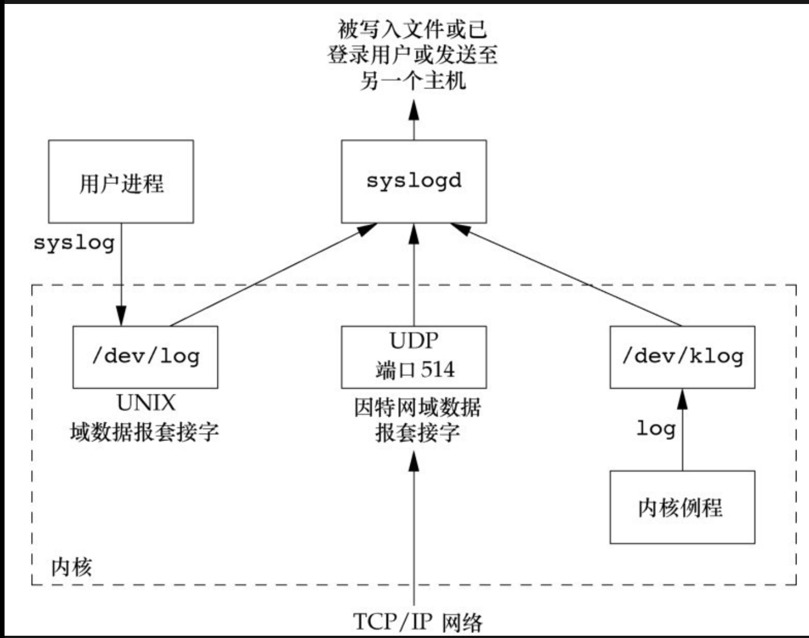

# 守护进程

* __守护进程(daemon)__ 是生存期长的一种进程,它们没有控制终端,在系统后台运行。


## 守护进程的特征
* 在ps输出的实例中,守护进程的名字通常出现在方括号中。
* 大多数内核守护进程的父进程的是pid为2的 kthread 特殊内核进程。
* 大多数守护进程都是以超级用户(root)运行。
* 所有的守护进程都没有控制终端。
* 用户层的守护进程的父进程是INIT进程。


```c
#ps -ajx 
PPID   PID  PGID   SID TTY      TPGID STAT   UID   TIME COMMAND
    0     1     1     1 ?           -1 Ss       0   0:09 /sbin/init
    0     2     0     0 ?           -1 S        0   0:00 [kthreadd]
    2     3     0     0 ?           -1 S        0   0:03 [migration/0]
    2     4     0     0 ?           -1 S        0   0:00 [ksoftirqd/0]
    2     5     0     0 ?           -1 S        0   0:00 [stopper/0]
    2     6     0     0 ?           -1 S        0   0:00 [watchdog/0]
    2     7     0     0 ?           -1 S        0   0:03 [migration/1]
    2     8     0     0 ?           -1 S        0   0:00 [stopper/1]
    2     9     0     0 ?           -1 S        0   0:00 [ksoftirqd/1]
    2    10     0     0 ?           -1 S        0   0:00 [watchdog/1]
    2    11     0     0 ?           -1 S        0   0:28 [events/0]
    2    12     0     0 ?           -1 S        0   0:22 [events/1]
    2    13     0     0 ?           -1 S        0   0:00 [events/0]
    2    14     0     0 ?           -1 S        0   0:00 [events/1]
    2    50     0     0 ?           -1 SN       0   0:00 [ksmd]
```

## 编程规则
* 1.首先调用umask清理文件模式创建屏蔽字。
* 2.调用fork,然后使父进程exit，子进程变为孤儿进程。保证子进程不是组长进程。
* 3.调用setsid 创建一个新会话,。使调用进程:
    * 成为新会话的首进程
    * 成为一个新进程的组长进程
    * 没有控制终端
* 4.更改当前工作目录为根目录
* 5.关闭不需要的文件描述符
* 6.连接文件描述符 0 1 2 到/dev/null不会在终端上看到输入

```c
#include "apue.h"
#include <syslog.h>
#include <fcntl.h>
#include <sys/resource.h>

void
daemonize(const char *cmd)
{
	int					i, fd0, fd1, fd2;
	pid_t				pid;
	struct rlimit		rl;
	struct sigaction	sa;

	// 清除文件模式屏蔽字
	umask(0);

	if (getrlimit(RLIMIT_NOFILE, &rl) < 0)
		err_quit("%s: can't get file limit", cmd);

    //创建一个孤儿进程
	if ((pid = fork()) < 0)
		err_quit("%s: can't fork", cmd);
	else if (pid != 0) /* parent */
		exit(0);
	setsid();

	sa.sa_handler = SIG_IGN;
	sigemptyset(&sa.sa_mask);
	sa.sa_flags = 0;
	if (sigaction(SIGHUP, &sa, NULL) < 0)
		err_quit("%s: can't ignore SIGHUP", cmd);
    //再次fork 保证子进程不是组长进程
	if ((pid = fork()) < 0)
		err_quit("%s: can't fork", cmd);
	else if (pid != 0) /* parent */
		exit(0);

    //改变当前工作路径
	if (chdir("/") < 0)
		err_quit("%s: can't change directory to /", cmd);

	// 关闭多余的文件描述符
	if (rl.rlim_max == RLIM_INFINITY)
		rl.rlim_max = 1024;
	for (i = 0; i < rl.rlim_max; i++)
		close(i);

	//重新定向文件描述符     0 1 2
	fd0 = open("/dev/null", O_RDWR);
	fd1 = dup(0);
	fd2 = dup(0);

	//设置日志
	openlog(cmd, LOG_CONS, LOG_DAEMON);
	if (fd0 != 0 || fd1 != 1 || fd2 != 2) {
		syslog(LOG_ERR, "unexpected file descriptors %d %d %d",
		  fd0, fd1, fd2);
		exit(1);
	}
}

int 
main(void)
{
    char cmd[2] = "ls";
    daemonize(cmd);
    while(1){
        sleep(2);
    }
}

out:
UID        PID  PPID  PGID   SID  C STIME TTY          TIME CMD
dev      20422     1 20421 20421  0 14:34 ?        00:00:00 ./a.out
```

## 出错记录

* __守护进程__没有控制终端，所以不能简单的将错误写到标准错误上,我们也不希望所有的守护进程都写到控制台设备上,syslog 设施对日志进行了统一的管理。


* 用户进程(守护进程)同过调用syslog 来产生日志消息,这些日志将被发送到UNIX域数据报套接字/dev/log
* 大多数syslog 的实现将使消息短时间处于队列中。如果有重复消息到达。syslog守护进程不会把他写入日志。而是会打印一条"上一条消息重复了N次的消息"

## 单实例守护进程
* 为了正常运作,某些守护进程会实现为,在任一时刻只运行该守护进程的一个副本。在一个时刻只能运行该守护进程的一个副本。
* 文件和记录锁机制为这种方法提供了基础。该方法保证一个守护进程只有一个副本运行，如果每一个守护进程创建一个固定名字的文件，并在该文件的整体上加一把写锁，在此之后创建写锁的尝试都会失败,这向后续守护进程副本指明了已有一个副本正在运行。

```
#include <unistd.h>
#include <stdlib.h>
#include <fcntl.h>
#include <syslog.h>
#include <string.h>
#include <errno.h>
#include <stdio.h>
#include <sys/stat.h>

#define LOCKFILE "/var/run/daemon.pid"
#define LOCKMODE (S_IRUSR|S_IWUSR|S_IRGRP|S_IROTH)

extern int lockfile(int);

int
already_running(void)
{
	int		fd;
	char	buf[16];

	fd = open(LOCKFILE, O_RDWR|O_CREAT, LOCKMODE);
	if (fd < 0) {
		syslog(LOG_ERR, "can't open %s: %s", LOCKFILE, strerror(errno));
		exit(1);
	}
    //守护进程的每个副本都将试图创建一个文件,并将进程ID写入该文件,如果该文件已经加锁,那个lockfile 函数将失败
	if (lockfile(fd) < 0) {
		if (errno == EACCES || errno == EAGAIN) {
			close(fd);
			return(1);
		}
		syslog(LOG_ERR, "can't lock %s: %s", LOCKFILE, strerror(errno));
		exit(1);
	}
	ftruncate(fd, 0);
	sprintf(buf, "%ld", (long)getpid());
	write(fd, buf, strlen(buf)+1);
	return(0);
}
```

## 守护进程惯例
* 若守护进程使用锁文件,那么该文件通常存储在__/var/run__目录下。命名方式通常是name.pid
* 若守护进程支持配置选项,那么配置文件通常存放在/etc目录中,配置文件的名字通常是name.conf
* 守护进程可用命令行启动,可以在etc/inittab中添加记路项
