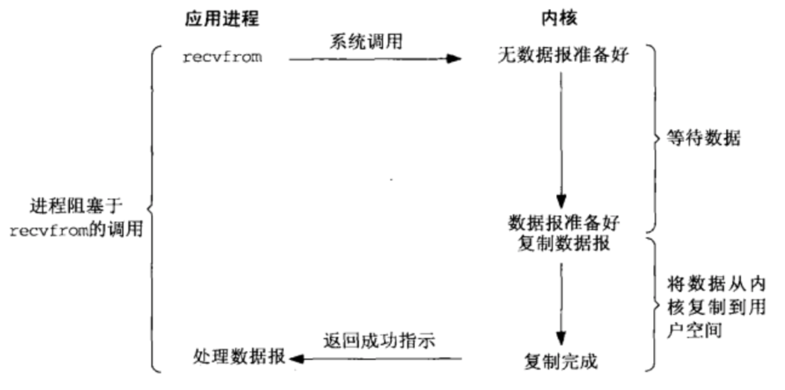
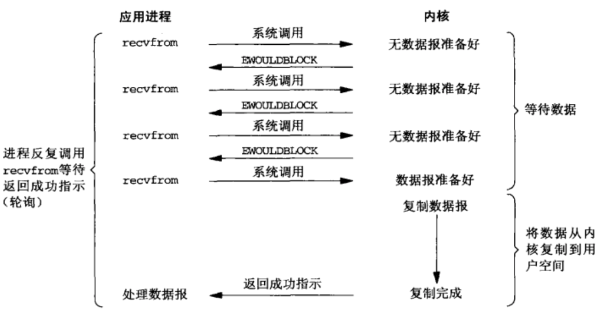
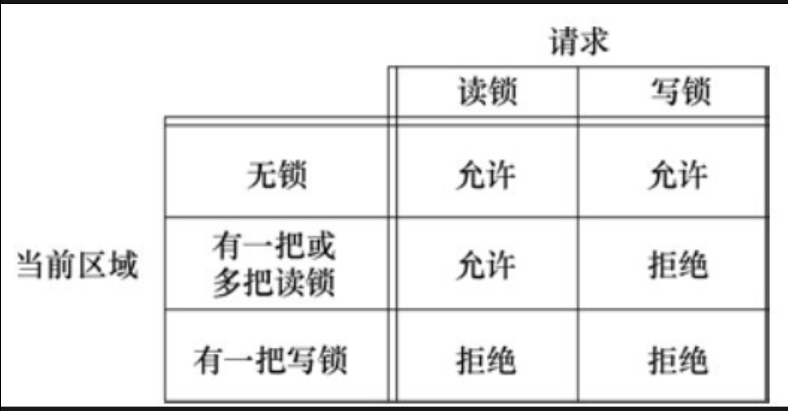

# 高级IO
* 非阻塞IO,记录锁,IO多路转接,异步IO,readv和writev,存储映射IO

## 阻塞IO模型
* 当进程在等待数据时，若内核缓冲区没有数据，则该进程将一直等待，直到等待的数据放入内存缓冲区，内核将数据从内核态拷贝到用户态。这个过程中进程的状态是阻塞的



## 非阻塞IO
* 用户态进程调用recvfrom接收数据，当前并没有数据产生，此时recvfrom返回EWOULDBLOCK，用户态进程会一直调用recvfrom询问内核，等到内核准备好数据的时候，之后用户态进程不再询问内核。待数据从内核复制到用户空间，recvfrom成功返回，用户态进程开始处理数据。


* 非阻塞IO实例
* 如果标准输出至终端,终端驱动程序一次能够接收的数据量有限,系统就会发起多次write调用,称之为__轮询__,在多用户系统上,这会极大的消耗CPU资源。


```
#include "apue.h"
#include <errno.h>
#include <fcntl.h>

char buf[500000];

int 
main(void)
{
    int     ntowrite,nwrite;
    char    *ptr;

    ntowrite = read(STDIN_FILENO,buf, sizeof(buf));
    fprintf(stderr, "read %d bytes\n",ntowrite);

    set_fl(STDOUT_FILENO, O_NONBLOCK);

    ptr = buf;
    while (ntowrite > 0){
        errno = 0;
        nwrite = write(STDOUT_FILENO, ptr, ntowrite);
        fprintf(stderr, "nwrite = %d, errno = %d\n",nwrite, errno);

        if (nwrite > 0){
            ptr += nwrite;
            ntowrite -= nwrite;
        }

    }
    clr_fl(STDOUT_FILENO, O_NONBLOCK);
    exit(0);
}
#只会调用一次write
out:
[dev@dev-centos6 lesson_13]$ ll /etc/services
-rw-r--r--. 1 root root 641020 Mar 22  2017 /etc/services
[dev@dev-centos6 lesson_13]$ ./a.out < /etc/services > temp.files
read 500000 bytes
nwrite = 500000, errno = 0
[dev@dev-centos6 lesson_13]$ vim temp.files
#多次调用 输出到标输出
[dev@dev-centos6 Documents]$ ./a.out < /etc/services 2>stderr.out

```
* 阻塞式IO 用户态进程会一直等待数据,非阻塞式IO用户态进程一直在轮询询问数据是否准备好,这是本质的不同。

## 记录锁(字节范围锁)
* 记录锁的功能是:当第一个进程正在读或修改文件的某个部分时,使用记录锁可以阻止其他进程修改同一文件区
* L_RDLCK-共享读锁,L_WRLCK-独占性写锁
    * 任意多个进程在一个给定的字节上可有一把共享的读锁,但是在一个给定的字节上只能有一个进程有一把独占写锁。
    * 如果在一个给定字节上已经有一把或多把读锁,则不能在改字节上再加写锁。
    * 如果在一个字节上已经有一把独占性写锁，则不能再对它加任何读锁。
    * 以上兼容性适用于不同进程提出的锁请求 

    
* 如果一个进程对一个文件区间已经有了一把锁，后来该进程又企图在同一文件区间再加一把锁，那么新锁将替换已有锁。

* 如果两个进程互相等待对方持有并且不释放(锁定)的资源时,这两个进程就会处于死锁状态。

    ```c
    #记录锁死锁
    #include "apue.h"
    #include <fcntl.h>

    static void
    lockabyte(const char *name, int fd, off_t offset)
    {
        if (writew_lock(fd, offset, SEEK_SET, 1) < 0)
            err_sys("%s:writew_lock error",name);
        printf("%s: got the lock, byte %lld\n",name, (long long)offset);
    }

    int
    main(void)
    {
        int     fd;
        pid_t   pid;

        if ((fd = creat("templock", FILE_MODE)) < 0)
            err_sys("create error");
        if (write(fd, "ab", 2) != 2)
            err_sys("wrtie error");

        TELL_WAIT();
        if ((pid = fork()) < 0){
            err_sys("fork error");
        } else if (pid == 0){
            lockabyte("child", fd, 0);
            TELL_PARENT(getppid());
            WAIT_PARENT();
            lockabyte("child", fd, 1);
        } else {
            lockabyte("parent", fd, 1);
            TELL_CHILD(pid);
            WAIT_CHILD();
            lockabyte("parent", fd, 0);
        }
        exit(0);
    }
    out:
    [dev@dev-centos6 lesson_14]$ ./a.out
    parent: got the lock, byte 1
    child: got the lock, byte 0
    parent:writew_lock error: Resource deadlock avoided
    child: got the lock, byte 1
    ```

* 记录锁的隐含继承和释放
    * 1.锁与进程和文件两者相关联,当一个进程终止时,它所建立的锁全部释放。无论一个文件描述符何时关闭,该进程通过这一描述符引用的文件上的任何一把锁都会释放

    ```c
    fd1 = open(pathname,...);
    read_lock(fd1,...);
    fd2 = dup(fd1);
    close(fd2);//close后fd1设置的锁被释放
    ```
    * 2.fork产生的子进程不继承父进程所设置的锁。
    * 3.执行exec后,新程序可以继承原执行程序的锁。

## IO多路转接(IO多路复用)
* 为了使用这种技术,先构造一张文件描述符的列表,然后调用一个函数,直到这些描述符中的一个已经准备好进行IO时,该函数才返回。 
* select:

```c
int select(int n, fd_set *readfds, fd_set *writefds, fd_set *exceptfds, struct timeval *timeout);
```
    * 1.参数:我们所关心的描述符,对于每个描述符我们所关心的条件(读,写，异常条件?),愿意等待多长时间
    * 2.返回值:返回已准备好的描述符数量
* 使用这三个宏可以操作fd_set 文件描述符

```c
FD_CLR(inr fd,fd_set* set)；用来清除描述词组set中相关fd 的位
FD_ISSET(int fd,fd_set *set)；用来测试描述词组set中相关fd 的位是否为真,用于测试描述符是否已经打开
FD_SET（int fd,fd_set*set）；用来设置描述词组set中相关fd的位
FD_ZERO（fd_set *set）； 用来清除描述词组set的全部位
```

* poll

```
int poll(stuct pollfd fdarray[], nfds_t nfds, int timeout)
```
    * 1.参数:与select不同,poll不是为每个条件(可读，可写,异常条件)构造描述符集。每个i数组元素指定一个描述符编号以及我们对该描述符感兴趣的条件。
    * 2.返回值:返回已准备好的描述符数量
    * pollfd结构
    
    ```c
    struct pollfd {
        int fd;
        short events;//要关注的事件
        short revents;//发生了那些事件
    }
    ```

* epoll #FIXME

## 存储映射IO
* 存储映射IO 能将一个磁盘文件映射到存储空间中的一个缓冲区上，于是，当从缓冲区中取数据时,就相当于读文件中的相应字节,将数据写入缓冲区,相应字节就自动写入文件。


