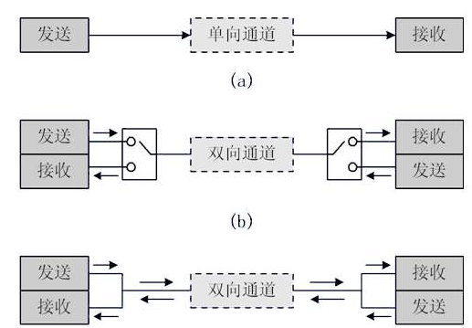
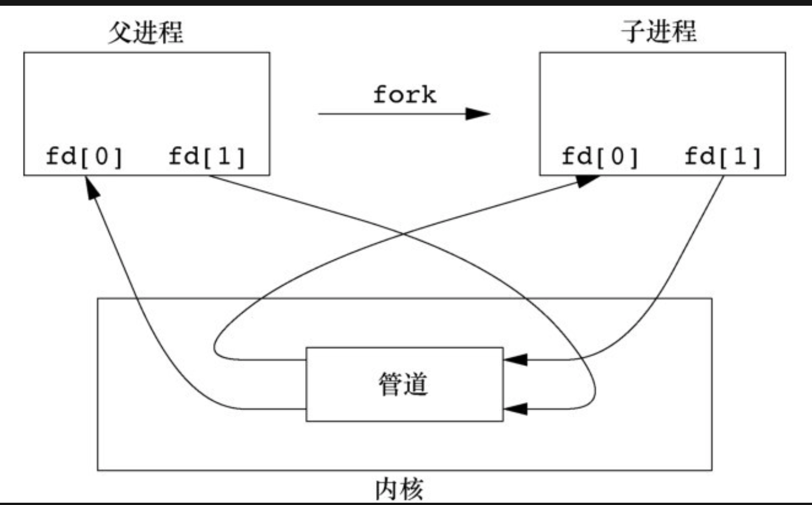

# 进程间通信
* 进程间相互通信的技术-__IPC__
* 经典IPC:
    * 管道 
    * FIFO
    * 消息队列
    * 信号量
    * 共享存储

## 管道(无名管道)
* 数据传输方式
    * 单工：通信双方中，一方固定为发送端，一方则固定为接收端。信息只能沿一个方向传输，使用一根传输线。

	* 半双工：通信系统每一端的发送器和接收器，通过收/发开关转接到通信线上，进行方向的切换，因此，会产生时间延迟。

    * 全双工：本身有类似PC机CPU的数据交换处理器，能够识别连接到交换机各端口上的网络设备的MAC地址，能够实现点到点的专用连接。 



* 半双工管道仍是最常见的IPC形式,每当在管道中键入一个命令序列,让shell执行时,shell都会为每一条命令单独创建一个进程，然后用管道将前一条命令进程的标准输出与后一条命令的标准输入相连接。
* 管道只能在具有公共祖先的两个进程之间使用。通常,一个管道由一个进程创建，在进程调用fork之后,这个管道就能在父进程和子进程之间使用。



* 对于从父进程到子进程的管道,父进程关闭管道的读端(fd[0]),子进程关闭写端(fd[1])。
* 对于从子进程到父进程的管道,父进程关闭管道的写端(fd[1]),子进程关闭读端(fd[0])。

```c
#管道通过pipe函数创建,经由参数fd放回两个文件描述符,fd[0] 为读而打开,fd[1]为写而打开
int pipe(int fd[2])
```

```c
//父进程到子进程的管道

#include "apue.h"

int 
main(void)
{
    int     n;
    int     fd[2];
    pid_t   pid;
    char    line[MAXLINE];

    if (pipe(fd) < 0)   
        err_sys("pipe error");
    if ((pid = fork()) < 0){
        err_sys("fork error");
    } else if (pid > 0){//父进程
        close(fd[0]);
        write(fd[1],"hello world\n",12);
    } else { //子进程
        close(fd[1]);
        n = read(fd[0],line, MAXLINE);
        write(STDOUT_FILENO, line, n);
    }
    exit(0);
}
out:
[dev@dev-centos6 lesson_15]$ ./a.out
hello world
```

```c
//使用管道从父进程中读取文件信息,传输到子进程中,交给分页程序执行处理

#include "apue.h"
#include <sys/wait.h>

#define	DEF_PAGER	"/bin/more"		//默认使用的分页程序 more

int
main(int argc, char *argv[])
{
	int		n;
	int		fd[2];
	pid_t	pid;
	char	*pager, *argv0;
	char	line[MAXLINE];
	FILE	*fp;

	if (argc != 2)
		err_quit("usage: a.out <pathname>");

	if ((fp = fopen(argv[1], "r")) == NULL) //读取一个用于分页的文本
		err_sys("can't open %s", argv[1]);
	if (pipe(fd) < 0)
		err_sys("pipe error");

	if ((pid = fork()) < 0) {
		err_sys("fork error");
	} else if (pid > 0) {								/* parent */
		close(fd[0]);		/* close read end */

		/*父进程读取文本内容,写入父进程管道的写端*/
		while (fgets(line, MAXLINE, fp) != NULL) {
			n = strlen(line);
			if (write(fd[1], line, n) != n)
				err_sys("write error to pipe");
		}
		if (ferror(fp))
			err_sys("fgets error");

		close(fd[1]);	/* close write end of pipe for reader */

		if (waitpid(pid, NULL, 0) < 0) //父进程等待子进程
			err_sys("waitpid error");
		exit(0);
	} else {										/* child */
		close(fd[1]);	/* close write end */
		if (fd[0] != STDIN_FILENO) {
            //复制子进程管道的读端文件描述符到标准输入
			if (dup2(fd[0], STDIN_FILENO) != STDIN_FILENO)
				err_sys("dup2 error to stdin");
			close(fd[0]);	/* don't need this after dup2 */
		}

        //执行文件分页程序,文件分页程序自动读取标准输入写到标准输出
		if ((pager = getenv("PAGER")) == NULL)
			pager = DEF_PAGER;
		if ((argv0 = strrchr(pager, '/')) != NULL)
			argv0++;		/* step past rightmost slash */
		else
			argv0 = pager;	/* no slash in pager */

		if (execl(pager, argv0, (char *)0) < 0)
			err_sys("execl error for %s", pager);
	}
	exit(0);
}
```
### popen pclose 
* 常见的管道操作是创建一个连接到另一个进程的管道,然后读其输出或向其输入端发送数据。
* 如果type=w,则返回的文件指针连接到cmdstring的标准输入
* 如果type=r,则返回的文件指针连接到cmdstring的标准输出

```c
//若成功,返回文件指针,出错,返回NULL。
FILE *popen(const char *cmdstring, const char *type);
```

```c
#include "apue.h"
#include <sys/wait.h>

#define	PAGER	"${PAGER:-more}" /* environment variable, or default */

int
main(int argc, char *argv[])
{
	char	line[MAXLINE];
	FILE	*fpin, *fpout;

	if (argc != 2)
		err_quit("usage: a.out <pathname>");
	if ((fpin = fopen(argv[1], "r")) == NULL)
		err_sys("can't open %s", argv[1]);

    //创建一个管道并执行分页命令
	if ((fpout = popen(PAGER, "w")) == NULL)
		err_sys("popen error");

	/* copy argv[1] to pager */
	while (fgets(line, MAXLINE, fpin) != NULL) {
		if (fputs(line, fpout) == EOF)//向分页命令的标准输入端写入数据
			err_sys("fputs error to pipe");
	}
	if (ferror(fpin))
		err_sys("fgets error");
	if (pclose(fpout) == -1)
		err_sys("pclose error");

	exit(0);
}
```


## FIFO(命名管道)
* __PIPE__ 命名管道只能在两个相关的进程之间使用,而且这两个相关的进程还要有一个共同创建了的父进程。但是,通过FIFO,不相关的进程也能交互数据。
* FIFO 是一种文件类型,存在于系统中。
* FIFO的典型使用:客户进程-服务进程的应用程序中,FIFO用作汇聚点,在客户进程和服务进程二者之间传递数据。
    * 客户进程通过向__众所周知的FIFO__中写数据,
    * 服务进程通过客户进程的PID创建__客户进程专用FIFO__进行应答


## XSI IPC
* __消息队列__ __信号量__ __管道__
* 每个内核中的IPC对象,都用一个非负整数的__标识符__加以引用。
* 标识是IPC对象的内部名,为使多个合作进程能够在同一IPC对象上汇聚,需要提供一个外包命名方案。为此每个IPC对象都与一个(key)相关联,将这个建作为该对象的外部名。
* 每个IPC都有权限结构,类似于文件系统结构

    ```c
    struct ipc_perm {
    uid_t uid; /* owner's effective user id */
    gid_t gid; /* owner's effective group id */
    uid_t cuid; /* creator's effective user id */
    gid_t cgid; /* creator's effective group id */”
    mode_t mode;/*access modes*/
    }
    ```

## 消息队列
* 消息队列是消息的链接表,存储在内核中，由消息队列标识符标识。
* 每个消息队列都有一个msqid_ds结构,用于定义队列当前的状态,每次取消息(msgrcv),或者发送消息(msgsend)后,都会更新队列。

    ```c
    struct msqid_ds
      {
        struct msqid_ds {
        struct ipc_perm msg_perm;
        time_t msg_stime;  /* last msgsnd time */
        time_t msg_rtime;  /* last msgrcv time */
        time_t msg_ctime;  /* last change time */
        unsigned short msg_qnum;    /* number of messages in queue */
        unsigned short msg_qbytes;  /* max number of bytes on queue */
        pid_t msg_lspid;   /* pid of last msgsnd */
        pid_t msg_lrpid;   /* last receive pid */
    };
    ```
* 消息总是放到队列的尾端,取用消息不一定是按照先进先出的次序读取消息,可以按需读取。
* 消息队列原来的实施目的是提供高于一般速度的IPC(全双工管道,UNIX域套接字),但与其他IPC相比,速度方面差距很小,在新的应用程序中,不应当再使用。

## 信号量
TODO


## 共享存储
* 共享存储允许两个或多个进程共享一个给定的存储区。因为数据不需要在客户进程和服务进程之间复制，所以这是最快的一种IPC。在多个进程之间同步访问一个给定的存储区。若服务器正在将数据放入共享存储区，则在它做完这一操作之前，客户进程不应该去取这些数据


