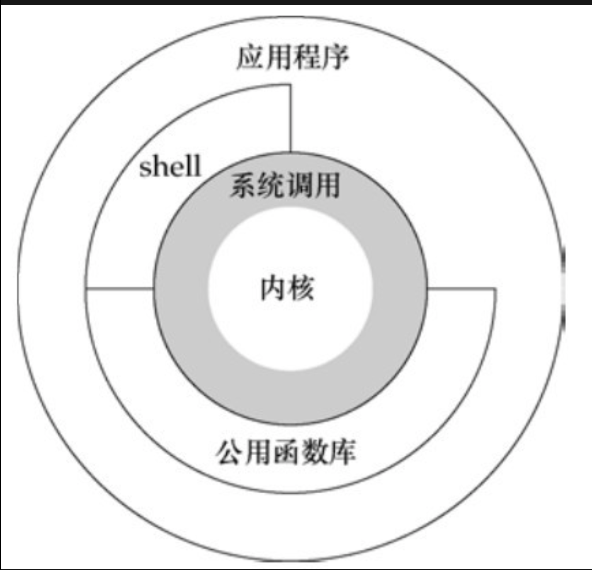

#  unix基础知识
* unix 体系结构
2. kernel(内核):一种软件，控制计算机的硬件资源，提供系统的运行环境
2. system call(系统调用):内核的接口
3. 公用函数库和shell在系统调用之上
4. 应用程序构建在最外层，既可以使用系统调用，也就可以使用公用函数库和shell


## 输入和输出
### 文件描述符(file descriptor)
* 通常是一个非负整数，内核用来标识一个特定的进程正在访问的文件，在读写文件都会使用文件描述符
### 标准输入,标准输出,标准错误 
* 当shell允许一个新程序时，默认打开三个文件描述符，标准输入(standard input)，标准输出(standard output)，标准错误(standard error)，不特殊指明都指向终端，但可以重定向到某个文件

```bash
#标准输出被重定向到文件
ls > file.list
```
### 不带缓冲的IO(直接使用文件描述符)

```c
/*
* 从标准输入(终端)中读取数据到buf中
* 从buf中写内容到标准输出(终端)中
* 编译以后执行 ```./a.out < infile > outfile```，实现文件复制
* STDIN_FILENO STDOUT_FILENO 分别代表了标准输入和标准输出的文件描述符
*/

#include "apue.h"                                
#define BUFFSIZE    4096
int
main(void)
{
    int n;
    char buf[BUFFSIZE];
    while ((n = read(STDIN_FILENO, buf, BUFFSIZE)) > 0)
        if (write(STDOUT_FILENO, buf, n) != n)
            err_sys("write error");
    if (n < 0)
        err_sys("read error");
    exit(0);
}
out:
➜  lesson_1 ./a.out < a1.txt > a2.txt
```

### 标准IO(带缓冲的IO)
* 标准IO函数为不带缓冲额IO函数提供了一个带缓冲的接口
    * 使用标准IO函数无需选择缓冲区大小
    * 简化了对输入的处理,fgets函数读取一个完整行,getc读取一个字符。

```c
/*
* get一次读取一个字符，读完显示EOF(-1)
*/
#include "apue.h"                       
int
main (void)
{
    int c;
    while ((c = getc(stdin)) != EOF)
        if (putc(c, stdout) == EOF)
            err_sys("output error");
    if (ferror(stdin))
        err_sys("input error");
    exit(0);
}
out:
➜  lesson_1 ./a.out < a1.txt > a2.txt
```

## 程序和进程
* 程序 program：一个可执行文件，内核使用exec将程序读入内存，用以执行
* 进程 process：程序执行的 __实例__，每个进程都有一个唯一的 进程ID
### 进程控制

```c
/*
* 启动程序，获取输入后，在父进程中创建出子进程，在子进程中执行命令
* 父进程等待子进程终止
* fork对子进程返回0对父进程返回id
*/
#include "apue.h"
#include <sys/wait.h>
int
main(void)
{
    char buf[MAXLINE];
    pid_t pid;
    int status;
    printf("%%");
    while (fgets(buf, MAXLINE, stdin) != NULL)
    {
        //换行替换为null
        if (buf[strlen(buf) - 1] == '\n')
            buf[strlen(buf) - 1] = 0;
        //创建子进程 父进程为程序主体
        if ((pid = fork()) < 0)
        {
            err_sys("fork error");
        }   
        //pid = 0 创建子进程成功
        else if (pid == 0)
        {
            //执行程序
            execlp(buf, buf, (char *)0);
            err_ret("Couldn't execute: %s", buf);
            exit(127);
        }   
        if ((pid = waitpid(pid, &status, 0)) < 0)
            err_sys("waitpid error");
            
        printf("%% ");
    }   
    exit(0);
}
```
### 线程thread
* 一个进程内的所有线程共享进程相关属性
* 线程也有ID，但只在所属进程内有意义

## 用户标识
* 每个用户有一个 __用户id__，不能更改，id为0的为root用户
* __组id__ 允许各个成员之间共享资源(同组之间)
* 用户还有 __附属组id__,一个用户只能有一个组,可以有多个附属组

## 信号(signal)
* 用于通知进程系统发生了某种错误(异常)，系统的处理方式有一下三种:
    * 忽略信号
    * 系统默认处理(如终止该进程)
    * 捕捉该信号,通过自编函数自己处理

* 系统产生了SIGINT (ctrl+c)信号，会在signal中捕捉到，然后调用sin_int函数处理

```c
#include "apue.h"
#include <sys/wait.h>
static void sig_int(int);
int 
main(void)
{
    char buf[MAXLINE];
    pid_t pid;
    int status;

    printf("%%");
    while (fgets(buf, MAXLINE, stdin) != NULL)
    {   
        if (buf[strlen(buf) - 1] == '\n')
            buf[strlen(buf) - 1] = 0;

        #产生SIGINT 跳转到指定的函数执行
        if (signal(SIGINT, sig_int) == SIG_ERR)
            err_sys("signal error");

        //创建子进程
        if ((pid = fork()) < 0)
        {   
            err_sys("fork error");
        }   
        //pid = 0 创建子进程成功
        else if (pid == 0)
        {   
            //执行程序
            execlp(buf, buf, (char *)0);
            err_ret("Couldn't execute: %s", buf);
            exit(127);
        }   

        if ((pid = waitpid(pid, &status, 0)) < 0)
            err_sys("waitpid error");

        printf("%% ");
    }   
    exit(0);
}
void sig_int(int signo)
{
    printf("interrupt\n%% ");
}                   
```

## 时间值
* 时钟时间:从进程从开始运行到结束，时钟走过的时间，这其中包含了进程在阻塞和等待状态的时间。
* 用户CPU时间:就是用户的进程获得了CPU资源以后，在用户态执行的时间。
* 系统CPU时间:用户进程获得了CPU资源以后，在内核态的执行时间。
* 运行时间=用户CPU时间+系统CPU时间
* 时钟时间＝阻塞时间＋就绪时间＋运行时间

```bash
ll@ubuntu:~/temp$ time  ./test  
    sdga  
    s   d   g   a     
    real    0m4.019s                     //时钟时间  
    user    0m0.004s           //用户CPU时间  
    sys 0m0.000s                   //系统CPU时间  
```

## 系统调用和库函数
* 所有UNIX都提供良好定义,数量有限,直接进入内核的入口点,这些入口点称为__系统调用__
* 每个__系统调用__在标准C库中都有一个具有同样名字的函数
* 应用程序既可以调用库函数,也可以系统调用,很多库函数会调用__系统调用__
* 系统调用通常提供一个最小接口,库函数则提供比较复杂的功能

## other 
* 实现ls命令

```c
#include "apue.h"
#include <dirent.h>

int 
main(int argc, char *argv[])
{
    DIR *dp;
    struct dirent *dirp;

    if (argc != 2)
        err_quit("usage: ls directiry_name");

    //返回一个目录流
    if ((dp = opendir(argv[1])) == NULL)
        err_sys("can't open %s", argv[1]);
    while ((dirp = readdir(dp)) != NULL)
        printf("%s\n", dirp->d_name);

    closedir(dp);
    exit(0);
}
out:
➜  apue ./a.out .
.
..
source
lesson_9
lesson_7
lesson_6
lesson_1
lesson_8
a.out
lesson_11
lesson_10
lesson_4
start.sh
lesson_5
```

