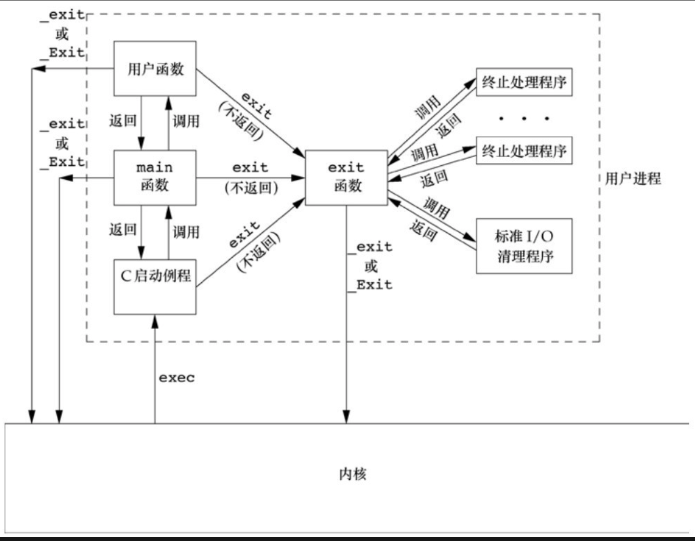
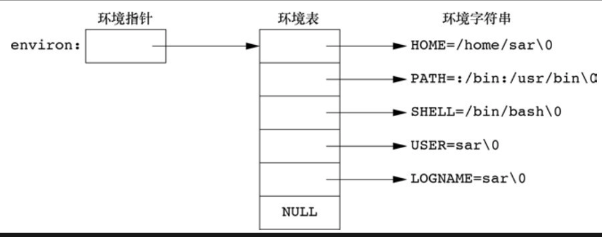
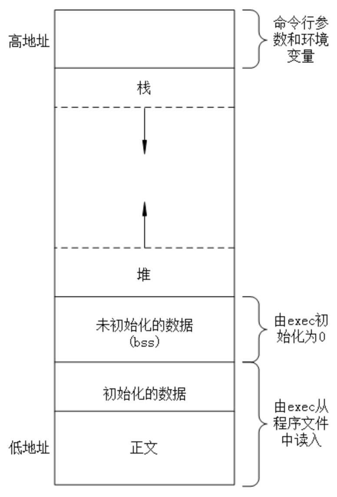
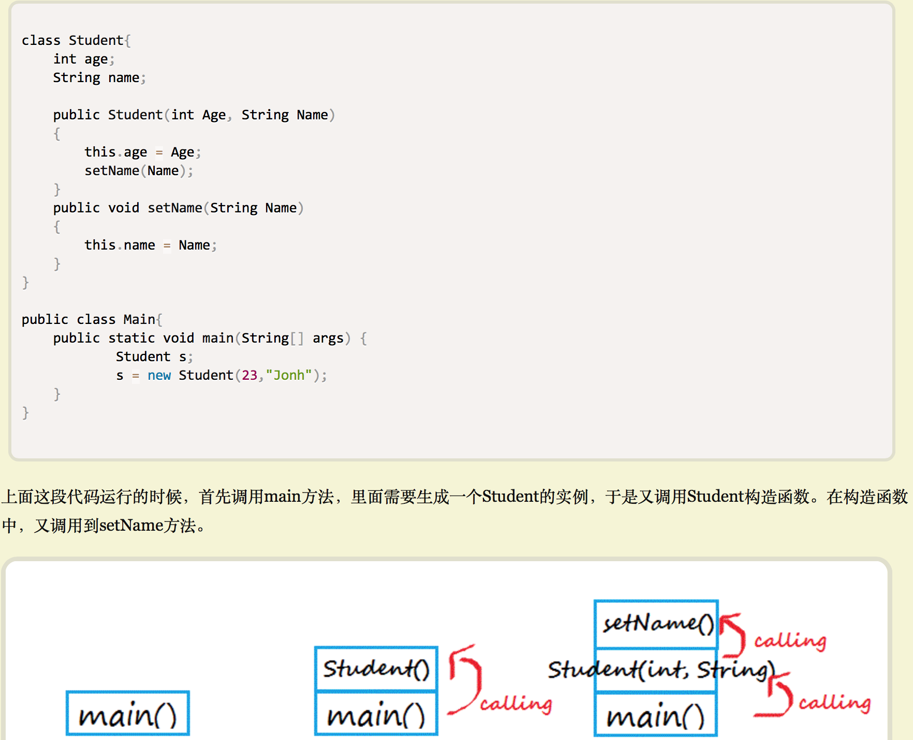

# 进程环境
## main 函数
* c程序总是从main函数开始执行,```int main(int argc, char *argv[])```
    * __argc__ 是命令行参数的数目,__argv__ 是指向参数的各个指针所构成的数组
    * 当内核使用一个__exec__ 函数执行c程序,在调用__main函数__前先调用一个特殊的__启动例程__。启动例程从内核取得__命令行参数和环境变量__,为执行main函数做好准备

## 进程终止
* 正常终止
    * 从main返回
    * 调用exit
    * 调用_exit,或_Exit
    * 最后一个线程从其启动例程返回
    * 最后一个线程调用 __pthread_exit__
* 异常终止
    * 调用 abort
    * 接到一个信号
    * 最后一个线程对取消请求作出响应
* 退出函数 用于正常终止一个程序,_exit和_Exit__立即进入内核,__exit__ 执行一个标准I/O库的清理关闭操作,对所有打开流调用fclose函数,这将造成输出缓冲中的所有数据都被冲洗(写到文件上)
* status 参数称为__终止状态__,或退出状态(exit status),shell提供了检查终止状态的方法,

```c
void exit(int status)
void _exit(int status)
void Eexit(int status)
```
* 如果调用的函数不带终止状态,或main函数没有声明返回类型为整形,或main函数return 了一个空,则终止状态是__未定义__的
* 如果main函数的返回值是整形，并且main执行到最后一条语句返回,那么该进程的终止状态是0
__return 0 等价于 exit(0)__

```c
#echo $?终止码是随机的
#include <stdio.h>
main(){
    printf("hello, world\n");
}
```
* 终止处理程序
    * 一个进程可以登记多至32个函数,这些函数将由__exit__ 自动调用,我们称之为__终止处理程序(exit handler)__,调用__atexit__来登记这些函数
    * exit 调用这些__终止处理程序__ 与登记时候的顺序相反,同一个函数如果被登记多次,也会被多次调用
    * exit 首先调用各终止处理程序,然后关闭所有打开流
    * 内核使程序执行的唯一方法是调用一个__exec函数__,进程自愿终止的唯一方法是显示或隐式调用exit,也可非自愿的由一个信号使其终止

## C程序的启动和终止
    * 内核使用一个__exec__ 函数执行c程序,在调用__main函数__前先调用一个特殊的__启动例程__。启动例程从内核取得__命令行参数和环境变量__,为执行main函数做好准备
    * 在程序结束,执行exit函数时,会首先执行终止处理程序,然后执行标准IO清理程序



```c
#终止处理程序调用
#include "apue.h"

static void my_exit1(void);
static void my_exit2(void);

int
main(void)
{
    if (atexit(my_exit2) != 0)
        err_sys("can't register my_exit2");

    if (atexit(my_exit1) != 0)
        err_sys("can't register my_exit1");

    if (atexit(my_exit1) != 0)
        err_sys("can't register my_exit1");
    printf("main is done\n");
    return (0);

}

static
void my_exit1(void)
{
    printf("first exit handler\n");
}
static
void my_exit2(void)
{
    printf("second exit handler\n");

}
out:
➜  lesson_7 ./a.out
main is done
first exit handler
first exit handler
second exit handler
```

## 命令行参数
* 执行一个程序时,调用__exec__的进程可以将命令行参数传递给程序

```c
#include "apue.h"

int
main(int argc, char *argv[])
{
    int i;

    for (i = 0; i < argc; i++)
        printf("argv[%d]:%s\n", i, argv[i]);
    exit(0);

}
➜  lesson_7 ./a.out arg1 TEST foo
argv[0]:./a.out
argv[1]:arg1
argv[2]:TEST
argv[3]:foo
```
## 环境表
* 每个程序都接收到一张__环境表__,与参数表一样,环境表也是一个字符指针数组。全局变量__environ__ 则包含了该指针数组的地址
* 环境表如下所示:

    

## C程序的存储空间布局
* 典型的存储空间安排
    
* __正文段__。通常,正文段是可共享的,所以即使是频繁执行的程序在存储器中也只需一个副本,正文段通常是可读的,反正程序由于意外而修改其指令。
* __初始化数据段__:包含了程序中需要明确赋值的变量(c程序中任何函数之外的声明)。```int maxcount = 99```
* __未初始化数据段__:(block start by symbol-由符号开始的块),在程序开始执行之前,内核将此段中的数据初始化为0或空指针(c程序中函数外的声明) ```long sum[1000] ```
* __栈__:__自动变量和函数__每次调用所需保存的信息都存放在此段中。每次函数调用时,返回的地址的调用者的环境信息都存储在栈中。最近被调用的函数在栈上为其自动和临时变量分配存储空间。
    * __表示函数或子例程像堆积木一样存放，以实现层层调用__
    
* __堆__:通常在堆中进行动态内存分配


## 共享库
* 大多数__UNIX__ 系统都支持共享库,共享库使得可执行文件中不再需要包含公用的库函数,而只需在所有进程的可引用的存储区中保存这种库例程的一个副本,程序第一次执行或者调用某个库函数时,用动态链接的方式将程序和共享库函数相链接。
    * 这会增加程序在第一次运行时的时间
    * gcc 默认使用共享库编译程序,编译后可执行文件的__正文和数据段__长度都显著减小。

## 存储空间分配
* 几个空间分配函数

    ```c
    #include <stdlib.h>
    void *malloc(size_t size)
    void *calloc(size_t nobj, size_t size)
    void *realloc(void *ptr, size_t newsize)
    void free(void *ptr)
    ```
    * malloc 分配指定__字节__的存储区,存储区中的初始值不确定
    * calloc 为指定数量指定长度的对象分配存储空间,该空间中的每一位(bit)都初始化为0
    * realloc 增加或减少以前分配区的长度,增加长度时,可能需要将内容存放在一块新的,更大的存储区中
    * free 释放__ptr__指向的存储空间,释放的空间通常被传入可用存储区池,可在再次调用分配函数时再次分配
* 大多数实现所分配的存储空间比要求的稍微大,额外的空间用来记录管理信息:分配块的长度,指向下一个分配块的指针等.
* 致命性错误
    * 在动态分配的内存区前后进行写操作,可能会破坏管理记录信息或其他内存块的数据。
    * 释放了一个已经释放了的块。
    * 调用free 的指针不是alloc函数返回的值。
    * 调动malloc后,忘记释放内存,造成__内存泄露__

## 环境变量
* 环境变量在UNIX系统中形式类似```name=value```,内核并不查看这些字符串,它们的解释完成取决于各个应用程序
* 使用__getenv__可以取到一个指定环境变量的值。任何时候,都应该直接使用__getenv__从环境变量中取值,不应该直接访问environ

```c
//返回一个name=value 的value指针
#include <stdlib.h>
char *getenv(const char *name)
```
* 设置的环境变量,只会影响当前进程及其后生成和调用的任何子进程环境。
```c
#include <stdlib.h>
int putenv(char *str)
int setenv(const char *name, const *value, int rewrite)
int unsetenv(const char *name)
```
* __putenv__ 取形式为name=value 的字符串,放入环境表中,如果name存在,则先删除之前的定义
* __setenv__ 将name设置为value,如果name已经存在。根据rewrite决定是否保留或设置新值
* __unsetenv__ 删除name定义,即使不存在也不会报错

* 修改过程
    * __环境表__ (指向实际name=value字符串的指针数组)和环境字符串通常存放在进程存储空间的顶部(栈之上)。
    * __删除__ :删除环境字符串很简单,只需要在环境表中找到该指针,然后将后续指针移动到环境表数组首部。
    * __增加或者修改__就比较困难,环境表和环境字符串通常位于__进程地址空间__顶部。不能向高地址(上)扩展,同时也不能移动之下的个栈帧,不能向低地址(下)扩展,两者的组合使得空间长度不能在增加。
    * __修改环境变量__: 
        * 如果新的value长度少于或等于现有长度,只需要将新字符串复制到原字符串所用空间
        * 如果新value长度大于原长度，必须调用malloc 为新字符串分配空间,然后将新字符串复制到该空间中,接着将环境表中原name的指针指向新分配区。
    * __新增__:首先需要为新的name=value分配空间,然后将此字符串分配到此空间中,然后将字符串复制到此空间中
        * 第一次新增一个name,则必须调用malloc为新的__指针表__分配空间。然后复制原来环境表的内容到新分配区，并将新的name=value字符串放入表尾。最后使environ指向新指针表。
        * 如果不是第一次新增一个name,只需调用realloc ,分配比原空间多存放一个指针的空间,然后将新的name=value字符串放入表尾,后面跟一个空指针

## 函数setjump 和 longjump

```c
#include <setjmp.h>
int setjmp(jmp_buf)
void longjmp(jmp_buf env, int val)
```
* __goto__ 语句是不能跨越函数的,执行这种类型跳转的函数是setjmp 和 longjmp,执行__非局部__的跳转,对处理发生很深层次的嵌套及其错误是很有用的。(否则只能使用检查返回值的方式处理错误)
    * __非局部__: 指跳转不是在一个函数内实施的，而是在栈上跳过若干调用帧，返回到当前函数调动路径的某一个函数中

* 当在cmd_add中检测到一个错误，调用longjmp函数，__env__的类型是一个特殊类型的jmp_buf,这个数据类型是某种形式的数组，存放调用longjmp时能用来恢复栈状态的所有信息。通常定义为全局变量。
* __longjmp__函数中的val参数会返回到main函数中的setjmp(作为setjmp的返回值),用来判断是那一个函数出现错误。本例中调用setjmp，会返回1

```c
#include "apue.h"
#include <setjmp.h>

#define	TOK_ADD	   5

jmp_buf	jmpbuffer;

int
main(void)
{
	char	line[MAXLINE];

	if (setjmp(jmpbuffer) != 0)
		printf("error");
	while (fgets(line, MAXLINE, stdin) != NULL)
		do_line(line);
	exit(0);
}

 . . .

void
cmd_add(void)
{
	int		token;

	token = get_token();
	if (token < 0)		/* an error has occurred */
		longjmp(jmpbuffer, 1);
	/* rest of processing for this command */
}
```

* 自动变量，寄存器变量和易失变量。
    * __全局变量__：在__函数外面__定义的变量为__全局变量__，工程内的所有文件都可以访问。但是它在整个工程内只能定义一次，不能有重复的定义，不然就会发生错误，而其他的文件要想使用这个变量，必须用__extern__来声明这个变量，这个声明叫做__引用声明__。如果你只是想在定义他的文件中使用它，而不允许在其他的文件中使用它，那么就用关键字static来在函数外面声明变量。这样这个变量在其他文件中将不可见。定义__静态变量__的时候并没有给变量初始化，则静态变量将被自动初始化为0；
    * __局部变量__：__局部变量__，如不作专门说明为__自动变量__，都是动态分配存储空间，存储在动态存储区中。这种变量叫__自动变量__。这种变量只在定义它们的时候才创建，在定义它们的函数返回时系统回收变量所占存储空间。对这些变量存储空间的分配和回收是由系统__自动完成__的，所以也叫自动变量。一般情况下，不作专门说明的局部变量，均是自动变量。自动变量也可用关键字auto作出说明。
    * __静态变量__：静态变量与自动变量的本质区别是，静态变量并不像自动变量那样使用堆栈机制来使用内存。而是为静态变量分配__固定__的内存，在程序运行的整个过程中，它都会被保持，而不会被销毁。这就是说静态变量的持续性是程序运行的__整个周期__。这有利于我们__共享数据__。如果静态变量在__函数内__部定义，则它的作用域就是在这个__函数内部__，仅在这个函数内部使用它才有效，但是它不同于自动变量的，自动变量离开函数后就会被销毁，而静态变量不会被销毁。他在函数的整个运行周期内都会存在。
    * __自动变量__：自动地存储于内存中，地址随机，即__局部变量__
    * __寄存器变量__：在c语言当中可以使用寄存器变量来优化程序的性能,最常见的是在一个函数体当中,将一个常用的变量声明为寄存器变量```register int a```。 如果可能的话,编译器就会为它分配一个__单独的寄存器__，在整个函数执行期间对这个变量的操作全都是对这个寄存器进行操作,这时候就不用频繁地去__访存__了,自然就提高了性能.但是寄存器变量不是强制性的,也就是,即使你使用__register关键字__去声明一个变量为寄存器变量，编译器还是有可能把它作为一个普通的变量而不是寄存器变量来使用的.
    * __易失变量__: __volatile__,在c中的作用大概有两点:
        * 表示变量是易失的,易变的
        * 强制访存操作,__防止编译器去优化__,告诉编译器每次必须去内存中取值,而不是从寄存器或者缓存.

```c
#include "apue.h"
#include <setjmp.h>

static void f1(int, int, int, int);
static void f2(void);

//全局变量
static jmp_buf jmpbuffer;
static int globval;

int 
main(void)
{
    int autoval; //自动变量
    register int regival;//寄存器变量
    volatile int volaval;//易失变量
    static int statval; //静态变量

    globval = 1; autoval = 2; regival = 3; volaval = 4; statval = 5;
    
    if (setjmp(jmpbuffer) != 0)
    {
        printf("after longjmp:\n");
        printf("globval = %d, autoval = %d, regiva = %d,"
                "volaval = %d, statval = %d\n",
                globval,autoval,regival,volaval,statval);
        exit(0);
    }
   
    /*在发生错误之前，setjmp之后 改变变量值*/
    globval = 95; autoval = 96; regival = 97; volaval = 98; statval = 99;
    f1(autoval,regival,volaval,statval);
    exit(0);
}
static void
f1(int i, int j, int k, int l)
{
    printf("in f1():\n");
    printf("globval = %d, autoval = %d, regiva = %d,"
            "volaval = %d, statval = %d\n",
            globval,i, j, k, l);
    f2();
}
static void
f2(void)
{
    longjmp(jmpbuffer, 1);
}

out:
➜  lesson_7 gcc testjmp.c
➜  lesson_7 ./a.out
in f1():
globval = 95, autoval = 96, regiva = 97,volaval = 98, statval = 99
after longjmp:
globval = 95, autoval = 96, regiva = 97,volaval = 98, statval = 99

➜  lesson_7 gcc -O testjmp.c #编译器优化
➜  lesson_7 ./a.out
in f1():
globval = 95, autoval = 96, regiva = 97,volaval = 98, statval = 99
after longjmp:
globval = 95, autoval = 2, regiva = 3,volaval = 98, statval = 99
```
* __全局变量(globval)，静态变量(statval)，和易失变量(volaval)__不受```gcc -O```优化的影响。他们的值是最后所修改的值
* 进行优化后，__自动变量(autoval)和寄存器变量(statval)__都存放在__寄存器__中。__易失变量__则存放在存储器中，如果要编写一个非局部调整的可移植程序，必须使用__volatile__属性,可以防止编译器去优化
* 存放在存储器中的变量将具有longjmp时的值,而在cpu和浮点寄存器中的变量则恢复为调用setjmp时的值,不进行优化时,所有变量都放在存储器中,进行优化后,autoval(自动变量) 和 regival(寄存器变量) 会存放在寄存器中。
* 如果要编写一个使用非局部跳转的可移植程序,必须使用volatile(易失变量)属性


## 进程资源限制

```c
#include <sys/resource.h>
int getrlimit(int resource, struct rlimit *rlptr)
int setrlimit(int resource, const struct rlimit *rlptr)
```
* 每个进程都有一组__资源限制__,这种限制通常是在系统初始化时由0进程建立的，然后由后续进程继承
* 更改资源限制时，需遵循下列规则:
    * 任何一个进程都可将一个__软限制(soft limit)__更改为小于或等于__硬限制(hard limit)__值
    * 任何一个进程都可以降低其硬限制，但必须大于或等于软限制。对普通用户__不可逆__
    * 只有__超级用户__进程可以提高硬限制值
* 资源限制影响到调用进程并由子进程继承。bash 的 unlimit 命令可以查看


