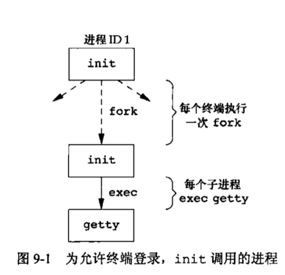
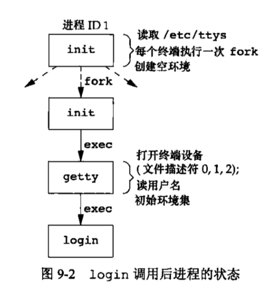
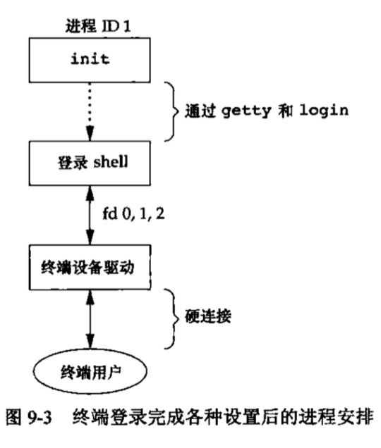
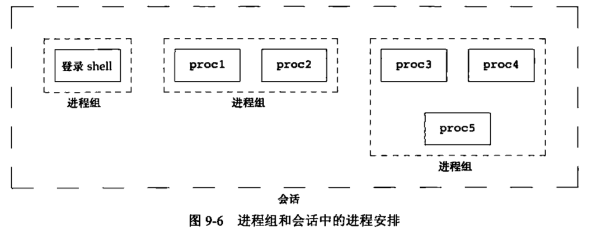
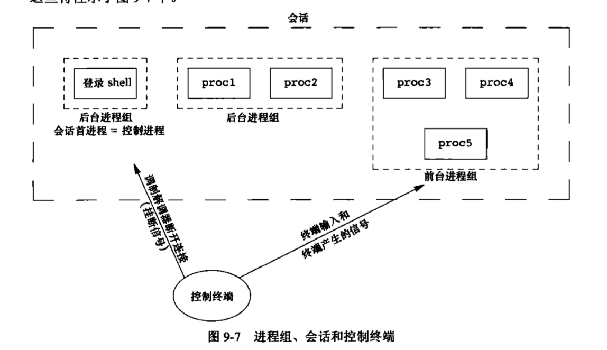
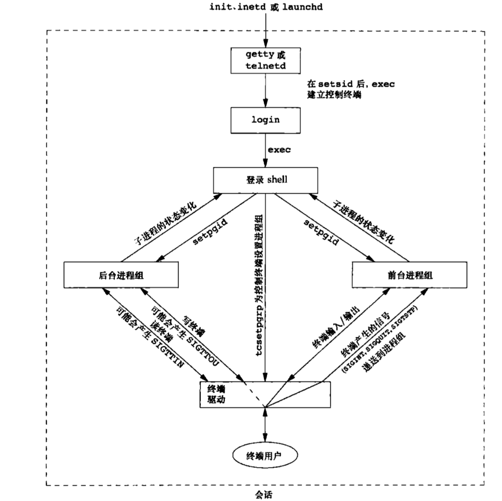

# 进程关系

## 终端登陆
* 当系统自举后时，内核创建进程ID为1的__init__进程。init进程使系统进入多用户模式。init读取文件__/etc/ttys__ ，对每一个允许登陆的终端设备，init调用一次fork,生成的子进程则exec getty程序。 如图
* __getty__: 设置终端机模式，连接速率，管制线路
* 所有进程的实际用户ID和有效用户ID都是0，init以__空环境__执行exec getty


* __getty__工作完成后执行exec  /bin/login如图:  


* login 能处理多项工作。因为得到了用户名，进而能够获取用户相关的其他信息。
* 至此，登陆用户的登陆shell开始运行，父进程ID为1，当进程终止后，init会得到通知(得到SINGCHLD信号)。登陆shell的文件描述符0，1，2设置为终端设备。

* 登陆shell 读取其__启动文件__ .bash_prifile 或 .profile ,这些启动文件通常更改某些环境变量并增加很多环境变量，执行完启动文件后，用户就能使用

## 进程组
* 每个进程除了有一个进程ID之外，还属于一个__进程组__。__进程组__是一个或多个进程的__集合__,每个进程组有一个唯一的进程组ID
* 每个进程组都有一个__组长进程__,组长进程的进程组ID等于其进程ID
* 进程组__组长__,可以创建一个进程组，创建该组中的进程，然后终止。只要在某个进程组中有一个进程存在，则该进程组就存在，与__组长进程__是否终止无光。
* 从进程组__创建__开始到其中最后一个进程__离开__为止的时间区间称为进程组的__生命期__,某个进程组的最后一个进程可以终止，也可以转移到另一个进程组。
* 进程调用__setpgid__ 可以加入一个现有的进程组或者创建新进程组
    * 一个进程只能为它自己或它的子进程设置进程组ID。在它的子进程调用了__exec__后，就无法更改子进程的进程组ID。
    * 在大多数作业控制中，fork之后的子进程和父进程代码段中，都会执行此函数设置自己的进程组ID,两次调用中有一个是__冗余__的,如果不这样做，fork之后，因为父子进程的运行顺序是不确定的，会因为子进程的组员身份取决于那个进程首先执行而产生__竞争条件__。

## 会话
* __会话__(session) 是一个或多个进程组的__集合__。通常是由shell管道将几个进程编成一组进程组```proc1 | proc2 ```

* __进程__ 调用setsid函数建立一个新会话

```c
#include <unistd.h>
pid_t setsid(void)
```
* 如果调用函数的进程不__组长进程__:
    * 该进程变成新会话的__会话首进程(session leader)__,该进程是新会话中的唯一进程
    * 该进程成为一个新进程组的__组长进程__。新进程组ID是调用进程的进程ID
    * 该进程没有__控制终端__,如果调用之前有,也会被切断
* 如果调用之前该进程已经是一个进程组__组长__。此函数出错。通常情况下，会先调用fork,然后使其父进程终止，子进程变成__孤儿进程__,子进程继续，因为子进程会继承父进程的__进程组ID__,而子进程的进程ID是新分配的。__进程ID一定不等于进程组ID__，该子进程一定不是一个__组长进程__.

## 控制终端
* 一个会话可以有一个__控制终端__,这通常是__终端设备(终端登陆)__或者__伪终端设备(网络登陆)__
* 建立与控制终端连接的会话守进程称为__控制进程__
* 一个会话中的几个进程组可被分成一个__前台进程组__,一个或多个__后台进程组__
* 无论何时键入终端的中断键,(ctrl+c),都会将中断信号发送至__前台进程组__的所有进程。
* 无论何时键入终端的退出键(ctrl+\),都会将退出信号发送给__前台进程组__的所有进程。
* 如果终端接口检测到网络已经断开，则将挂断信号发送给__控制进程(会话首进程)__

* 通常情况下，控制终端会在登陆时，自动建立
* 程序无时无刻都需要与控制终端交互作用，保证程序能与控制终端对话的方法是open 文件```/dev/tty```.在内核中，此控制文件是控制终端的同义语。

## 作业控制
* 本节用到的信号

```c
当后台作业要从用户终端读数据时, 该作业中的所有进程会收到SIGTTIN信号. 缺省时这些进程会停止执行
SIGCONT让一个停止(stopped)的进程继续执行. 本信号不能被阻塞.
SIGTTOU写终端(或修改终端模式)时收到

```

* 作业控制允许在一个终端上启动多个__作业(进程组)__,控制那一个作业可以访问终端以及那些作业在后台运行
* 作业控制要求一下3种形式的支持:
    * 支持作业控制的__shell__
    * 内核中的__终端驱动程序__必须支持作业控制
    * 内核必须提供对某些作业控制信号的支持
* shell使用__作业控制__的角度看，用户可以在前台或后台启动一个作业控制。一个作业只是几个进程的集合，通常是一个管道进程。

```c
//前台启动只有一个进程的作业
vim main.c
//后台启动两个作业,所有作业都在后台运行
pr *c | lpr & //第一个作业 用管道连接进程组
make all & //第二个作业
```
* shell启动后台作业示例,作业编号为1,启动进程41035:
* 作业完成后，键入回车键，shell通知作业完成,shell只有在__键入回车__或输入__新命令__之前打印作业的状态改变

```c
[dev@localhost ~]$ pr hello.py &
[1] 41035
$ pr的输出
$ 输入回车
[1]+  Done                    pr hello.sh
```
* 可以使用以下三个特殊字符使终端驱动产生信号，并发送给前台进程组,后台进程组不受影响:
    * __中断字符__(delete 或 ctrl+C) 产生 SIGINT
    * __退出字符__(ctrl+\) 产生 SIGQUIT
    * __挂起字符__(ctrl+z) 产生SIGTSTP
* 终端驱动程序必须处理与作业控制相关的另一种情况,只有__前台作业__接收终端输入，如果后台作业试图__读终端__(获取终端的输入)，__终端驱动程序__将检查这种情况，并向后台发送一个特定的__SIGTTIN__信号,该信号通常会停止后台作业,用户就可以通过shell命令将此作业转到前台运行。于是后台作业就可以读终端


```c
#后台作业视图读终端 未果
[dev@localhost ~]$ cat > temp.foo &
[1] 41096
#回车 获取作业状态 发送SIGTTIN 信号
[dev@localhost ~]$

[1]+  Stopped                 cat > temp.foo
#转前台执行,并发送继续信号SIGCONT 命令顺利读取终端输入
[dev@localhost ~]$ fg %1
cat > temp.foo
hello world

[dev@localhost ~]$ cat temp.foo
hello world
```

* 如果后台作业输出到__控制终端__，我们可以禁止或允许此选项。在禁止后台作业写控制终端后，cat命令试图__写标准输出__，此时，终端驱动程序识别出写操作来自于__后台进程__，于是向作业发送__SIGTTOU信号__，cat进程阻塞。直到调用fg命令转为前台。

```c
[dev@localhost ~]$ cat temp.foo &
[1] 41144
[dev@localhost ~]$ hello world


[1]+  Done                    cat temp.foo
#禁止后台作业输出至终端
[dev@localhost ~]$ stty tostop
[dev@localhost ~]$ cat temp.foo &
[1] 41146
[dev@localhost ~]$ fg %1
cat temp.foo
hello world
```
* 前后台作业以及终端驱动的作业控制总结


## ps 命令
* ppid: 父进程
* pgid: 进程组
* sid: 会话
* tpgid: 控制终端，标明前台进程组

```c
[dev@localhost ~]$ ps -o pid,ppid,pgid,sid,comm
PID   PPID   PGID    SID COMMAND
41177  41176  41177  41177 bash
53885  41177  53885  41177 ps
[dev@localhost ~]$ ps -o pid,ppid,pgid,sid,tpgid,comm
PID   PPID   PGID    SID  TPGID COMMAND
41177  41176  41177  41177  53886 bash
53886  41177  53886  41177  53886 ps
```
## 孤儿进程组
* __孤儿进程__: 一个父进程已终止的进程称为__孤儿进程__,这种进程由__init__进程收养。整个进程组也可能成为__孤儿__

* 处理孤儿进程组
    * 父进程sleep,子进程先运行，第一次打印状态，调用kill函数发送停止信号(SIGTSTP),这将__停止__子进程，不是__终止__。
    * 父进程终止后，子进程成为孤儿进程，父进程ID变为1。子进程成为一个孤儿进程组成员，一个进程组不是孤儿进程组的条件是:该组中有一个进程，其__父进程(本例中id=1)__属于另一个会话。
    * 父进程终止后,进程组中包含一个停止的进程，系统会向新孤儿进程组的处于停止状态的每一个进程发送__挂断信号(SIGHUP)__。接着发送继续信号。
    * 子进程对挂断信号的默认动作是终止该进程，在示例中直接调用sig_hup函数,处理挂断信号后，在继续信号的作用下，继续运行。


```c
#include "apue.h"
#include <errno.h>

static void
sig_hup(int signo)
{
    printf("SIGHUP received, pid = %ld\n", (long)getpid());
}

static void
pr_ids(char *name)
{
    printf("%s: pid = %ld,ppid = %ld pgrp = %ld, tpgrp = %ld\n", name, (long)getpid(), (long)getppid(), (long)getpgrp(), (long)tcgetpgrp(STDIN_FILENO));
    fflush(stdout);
}

int 
main(void)
{
    char c;
    pid_t pid;

    pr_ids("parent");

    if ((pid = fork()) < 0){
        err_sys("fork error");
    }else if(pid > 0){
        //父进程睡眠 子进程在父进程前运行
        sleep(5);
    }else{
        pr_ids("child");
        //挂断信号处理函数 不是发送挂断信号
        signal(SIGHUP, sig_hup);
        //停止子进程 不是终止 先挂起子进程，让父进程结束，成为孤儿进程
        kill(getpid(), SIGTSTP);
        pr_ids("child");
        if (read(STDIN_FILENO, &c, 1) != 1)
            printf("read error %d on contrnlling TTY\n", errno);
    }
    exit(0);
}
out:
➜  lesson_9 ./a.out
parent: pid = 44547,ppid = 126 pgrp = 44547, tpgrp = 44547
child: pid = 44548,ppid = 44547 pgrp = 44547, tpgrp = 44547

SIGHUP received, pid = 44548
child: pid = 44548,ppid = 1 pgrp = 44547, tpgrp = 44547
read error 5 on contrnlling TTY
```
