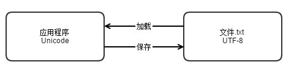
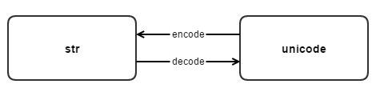

# 文本和字节序列
## 字符问题
* py3中,__字符__ 的最佳定义的__Uincode__ 字符。py3从str 对象中获取的元素是Unicode字符,py2的str 对象中获取的是__字节byte序列__
* __unicode__标准把字符的标识和具体字节表述进行了如下明确区分:
    * 字符的标识__码位__,在unicode标准中以__16进制__标识,加前缀__u__
    * 字符具体代表什么取决于__编码__ 方式,有utf8 utf16 gbk 等。
* 把码位装换成字节序列的过程是__编码__。 把字节序列装换成码位的过程是__解码__
* __解码__ :字节序列变成人类可读的uincode字符串
* __编码__:unicode 变成机器可以识别的字节序列




```python
>>> s = 'café'
#4个unicode 字符
>>> len(s)
4
>>> s
'café'
#编码成bytes字节序列
>>> b = s.encode('utf8')
>>> b
b'caf\xc3\xa9'
#字节序列解码成unicode字符
>>> b.decode('utf8')
'café'
```
## 字节概要
* __bytes__ 和 __bytearray__ 对象的各个元素是介于0-255的整数。

```python
#给定指定的编码方式构建
>>> cafe = bytes('café', encoding='utf8')
>>> cafe
b'caf\xc3\xa9'
#各个元素都是0-255整数
>>> cafe[0]
99
#bytes对象的切片还是bytes对象
>>> cafe[:1]
b'c'
#
>>> cafe_arr = bytearray(cafe)
>>> cafe_arr
bytearray(b'caf\xc3\xa9')
>>> cafe_arr[-1:]
bytearray(b'\xa9')
```
## 基本的编解码器
* python 自带了100种编解码器，用于文本的字节序列的装换

```python
#使用不同的编码器得到了不同的结果
>>> for codec in ['latin_1', 'utf8', 'utf16']:
...     print (codec, 'El Niño'.encode(codec), sep='\t')
latin_1 b'El Ni\xf1o'
utf8    b'El Ni\xc3\xb1o'
utf16   b'\xff\xfeE\x00l\x00 \x00N\x00i\x00\xf1\x00o\x00'
```

## 编码异常问题
### UnicodeEncodeError
* __UnicodeEncodeError__ 编码错误(字符串转化为二进制序列)
* 多数非utf编码器只能处理__Unicode__ 字符的很小一部分子集,如果目标编码没有定义某个字符,就会抛出__UnicodeEncodeError__ 异常

```python
>>> city = 'São Paulo'
>>> city.encode('utf8')
b'S\xc3\xa3o Paulo'
>>> city.encode('utf16')
b'\xff\xfeS\x00\xe3\x00o\x00 \x00P\x00a\x00u\x00l\x00o\x00'
>>> city.encode('iso8859_1')
b'S\xe3o Paulo'
#cp437编码么无法处理\xe3
>>> city.encode('cp437')
Traceback (most recent call last):
  File "<input>", line 1, in <module>
    city.encode('cp437')
  File "/Users/gongyulei/py_env/py36/bin/../lib/python3.6/encodings/cp437.py", line 12, in encode
    return codecs.charmap_encode(input,errors,encoding_map)
UnicodeEncodeError: 'charmap' codec can't encode character '\xe3' in position 1: character maps to <
undefined>
#忽略无法处理的部分
>>> city.encode('cp437',errors='ignore')
b'So Paulo'
#无法处理的部分替换成?号
>>> city.encode('cp437',errors='replace')
b'S?o Paulo'
#无法处理的部分替换成xml实体
>>> city.encode('cp437',errors='xmlcharrefreplace')
b'S&#227;o Paulo'
>>>
```
### UnicodeEDecodeError
* 不是每一个字节序列都包含有效的__ascii__ 字符,或包含有效的__utf8__
* 解码遇到无法装换的字节序列会抛出 UnicodeDecodeError
* 解码错误可能出现__乱码字符(鬼符)__ 或抛出 __UnicodeEncodeError__ 错误

```
>>> octets = b'Montr\xe9al'
>>> octets.decode('cp1252')
'Montréal'
>>> octets.decode('iso8859_7')
'Montrιal'
>>> octets.decode('koi8_r')
'MontrИal'
#无法解码0xe9 抛出异常
>>> octets.decode('utf8')
Traceback (most recent call last):
  File "<input>", line 1, in <module>
    octets.decode('utf8')
UnicodeDecodeError: 'utf-8' codec can't decode byte 0xe9 in position 5: invalid continuation byte
#使用replace 替换特殊字符
>>> octets.decode('utf8', errors='replace')
'Montr�al'
>>>
```
## 处理文本文件
* 在输入(__读取文件__)要尽早的把字节序列__解码(decode)__成字符串(unicode),在业务逻辑中只处理字符串对象,在处理过程中,__绝对__不要__编码或解码__.在输出的时候才编码(__encode__)为字节序列(str)。
* 在多台设备中公用一套代码,在打开文件时一定要显示的指定__encoding(编码)__参数。
* 特殊情况，在打开文件时不要使用__二进制模式b__


