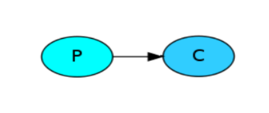
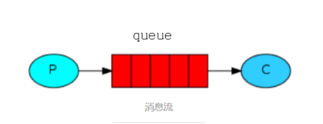
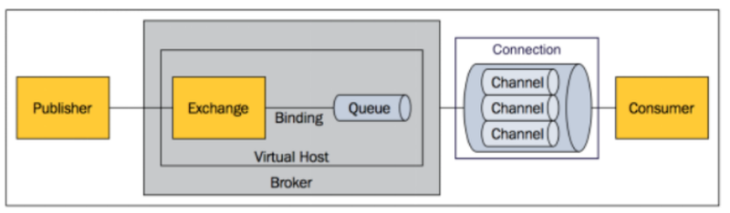

# rabbitmq base 
## 应用场景架构

* __rabbitmq server__: 维护了一条从 __produce__ 到 __consumer__ 的路线，保证数据的传输
* __client A B__: (__produce__) 数据的发送方，包含了(__payload__:发送的数据内容)(__label__:要发送的交换器tag，决定了消息发送给哪一个consumer)
* __client 1 2 3__ :(__consumer__):数据的接收方，接收发送过来的消息
* __exchange__:(__produce__) 发送消息到交换器中，交换器通过 __routing_keys__ 发送到指定队列
1. __direct__ :通过 __routing_key__ 匹配队列
2. __fanout__: 广播
3. __Topic__: 模式匹配
* __Connecion__ :TCP连接，程序的起始部分就是建立tcp连接
* __Channels__: 建立在tcp之上，建立完Connection就是建立通道，数据的流通基于通道

## 传统的通信方式

* p为__发送消息者__，c为__接受者__，在这种高度耦合的情况下:
    * 1.假设p每秒可发送10次消息，c每秒接收5次消息。在这种情况下，需要c处理完两次数据，p才能发送一次
    * 2.如果两者中一个发生故障，则两者都无法进行工作

## 生产消费者模型

* 在引入了队列的情况下，进行解耦，发布者只需要将消息发送到queue中，使用者只需要从队列中取消息。

* python 消息队列
    * __线程queue__ (同一进程下线程之间进行交互)
    * __进程queue__ (父子进程交互，同一进程下多个子进程交互)
* 不同的系统之间，就需要使用__AMQP__ ,无法使用python queue

## 基本概念

* publisher 为__生产者__,consumer为__接收者__。
* __broker__ 接收和发送消息
* __exchange__ 根据规则发送消息到对应queue中
* __queue__ 存放消息

## 详解
* Message:由__消息头和消息体__组成
    * 消息头：由一系列的可选属性组成，这些属性包括__routing-key（路由键__、__priority（相对于其他消息的优先权）__、__delivery-mode（指出该消息可能需要持久性存储__。
* Broker：表示消息队列服务器实体，接收和分发消息应用
* Exchange: 匹配查询表中的routing_key 分发消息到queue中
    * __direct__ :通过 __routing_key__ 匹配队列
    * __fanout__: 广播
    * __Topic__: 模式匹配
* binding: exchange和queue中的虚拟连接
* queue :消息最终被送到这里等待consumer取走。
* Connection: publisher consumer和broker之间的TCP连接。
    * 断开连接的操作只会在__client__端进行，__Broker__不会断开连接，除非出现网络故障或broker服务出现问题。
* Channel：建立在真实的TCP连接（ Connection ）内部的虚拟连接.
    * 每一次访问RabbitMQ都建立一个Connection，在消息量大的时候建立TCP Connection的开销将是巨大的，效率也较低。(对于操作系统来说建立和销毁 TCP 都是非常昂贵的开销，所以引入了信道的概念，以复用一条 TCP 连接。)

## Exchange 分发规则详解
* direct
    * 首先执行binding将__交换器exchange__与__队列queue__进行绑定，并指明binding_key（此key代表此队列只接受routing_key与之相同的消息）.
    * producer产生消息并指定routing_key,当消息进入broker,首先接触到exchange，然后查询分发规则为direct后，根据routing_key匹配查询表中的binding_key，然后发送到对应的队列当中。否则丢弃。
* fanout
    * 首先执行binding将__交换器exchange__与__队列queue__进行绑定（无需指明binding_key）
    * producer产生消息,当消息进入broker,首先接触到exchange，然后查询分发规则为fanout后，将此消息发送到与exchange绑定的所有队列中。
* topic
    * 首先执行binding将__交换器exchange__与__队列queue__进行绑定，指明binding_key（格式如usa.#,代表此队列只接受routing_key为usa开头的消息)
    * producer产生消息,并指明routing_key(格式如usa.news)当消息进入broker,首先接触到exchange，然后查询分发规则为topic后，匹配查询表将此消息发送到binding_key为usa.#/#.news/#的队列上。
    * __Routing_key__ 中可以包含两种通配符，类似于正则表达式：
    “#”通配任何零个或多个word
    “*”通配任何单个word

