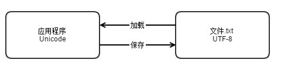
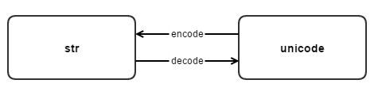

# 编码问题
* 计算机底层的所有数据，本质上都是按照，010101这样的形式来存储的。

## ASCII (American Standard Code for Information Interchange)
* 设计之初，英语的字符个数有限，26个大小写字母，一些特殊符号，在计算机中用__一个字节__的存储空间来表示一个字符是绰绰有余的，一个字节等于8个比特位,可以表述256个符号。于是美国人就制定了一套字符编码的标准ASCII,每个字符都对应一个唯一的数字，比如字符A对应01000001。这里只用到7位，第一位永远是0

## EASCII(ISO/8859-1)
* EASCII在ASCII 的基础上扩展，把原来的7位扩充到8位，完全兼容ASCII。然而EASCII时代是一个混乱的时代，大家没有统一的标准，各自把最高位按照自己的标准实现了一套。比较著名的有CP437，CP437是windows系统中使用的字符编码。还有ISO/8885-1,这些众多的ASCII扩充字符集之间互相不兼容

## GBK

* 因为常见的汉字成千万，大大超出了ASCII编码所表示的字符范围，所以中国人自己弄了一套编码叫GB2312,同时兼容ASCII。后来因为要收录更多的汉字，创建了GBK编码，GBK编码统一兼容ASCII,对于英文字符用一个字节表示，汉字用两个字节表示。

## Unicode

* 全世界为了统一编码标准,提出了unicode编码,unicode编码有俩种格式,UCS-2和UCS-4,UCS-2就是用两个字节编码，16位。UCS-4用4个字节编码，32位，理论上覆盖了所有的语言,世界上所有的字符，都可以用unicode表示。
* unicode 局限:
    * 浪费空间，因为都要用两个字节表示
    * 如果不提前告诉计算机，计算机是不知道到达2个字节确定一个字符还是1个字节确定一个字符(2个字符)
* unicode 只是规定如何编码,并没有规定的如何传输,保存这个编码。例如“汉”字的Unicode编码是6C49,我们可以用4个ascii数字来传输，保存这个编码。也可以用utf-8编码的3个连续字节E6 B1 89来表示。关键在于通信双方都要认可。uniclde编码有不同的实现方式，utf-8，utf-16等等。
* 这里的unicode 就像英语一样，作为国与国直接交流世界通用的标准，每个国家有自己的语言，他们把标准的英文文档翻译成自己国家的文字。这就是实现方式，就像utf-8

## UTF-8
* utf-8作为unicode的一种__实现方式__,是一种变长的字符编码，可以根据具体的情况用1-4个字节来表示一个字符。


# python 字符编码
* python 诞生时间比较早，默认编码格式为ASCII

```
py27
>>> import sys
>>> sys.getdefaultencoding()
'ascii'
```

```
py36
>>> import sys
>>> sys.getdefaultencoding()
'utf-8'
```
* 在py27中如果不在源代码文件中显示的指定编码,将会出现语法错误

```
py27
➜  ~ python a.py
  File "a.py", line 6
  SyntaxError: Non-ASCII character '\xe4' in file a.py on line 6, but no encoding declared; see http://python.org/dev/peps/pep-0263/ for details
```

* 在py36中因为系统默认的编码格式为utf8,不会报错

## str 和 unciode
* 在python中和字符相关的数据类型，分别是__str__ 和 __unicode__。他们都是basestring的子类,str 和uncode 是两种不同类型的字符串对象
* 对于同一个汉字，用str表示是，它对应的就是utf-8编码的'\xe5\xa5\xbd',而用unicode表示，对应的符号就是u'\u597d'

```
py27
>>> a = '好'
>>> type(a)
<type 'str'>
>>> a
'\xe5\xa5\xbd'
>>> b = u'好'
>>> type(b)
<type 'unicode'>
>>> print b
好
```

* 不论什么语言，Unicode编码都成为了语言的默认编码格式。而数据保存到介质中的时候，不同的介质可以由不同的方式,有些人喜欢用utf8,有些喜欢用gbk,只要平台统一编码规范就行


* str和unicode的转换,decode,encode

    * 字符串<unicode> 通过 字符编码方案(CES)编码(Encode) 得到字节串<str>
    * 字节串<str> 通过 字符编码方案(CES)解码(Decode) 得到字符串<unicode>

```
#unicode 到 str 的转换
>>> a = u'好'
>>> c = a.encode('utf8')
>>> type(c)
<type 'str'>
>>> print c
好
#str 到 unicode的转换
>>> a = '好'
>>> c = a.decode('utf8')
>>> type(c)
<type 'unicode'>
>>> print c
好
```
    
* str() 和 unicode() 方法
    * str(s3)相当于执行了s3.encode('ascii'),因为你好两个字不能用ascii码表示，所以报错
    * ```s3.encode('utf8')``` 就能正确转化为str

    ```
    >>> s3 = u'你好'
    >>> s3
    u'\u4f60\u597d'
    >>> str(s3)
    Traceback (most recent call last):
      File "<stdin>", line 1, in <module>
      UnicodeEncodeError: 'ascii' codec can't encode characters in position 0-1: ordinal not in range(128)
    >>> s3.encode('ascii')
    Traceback (most recent call last):
      File "<stdin>", line 1, in <module>
      UnicodeEncodeError: 'ascii' codec can't encode characters in position 0-1: ordinal not in range(128)
    ```

    * unicode(s4)相当于执行了s4.decode('ascii'),需要转化为unicode就要指定源编码格式
    * ```s4.decode('utf8') u'\u4f60\u597d' ``` 就能正确转化为unicode

    ```
    >>> s4 = '你好'
    >>> type(s4)
    <type 'str'>
    >>> unicode(s4)
    Traceback (most recent call last):
      File "<stdin>", line 1, in <module>
      UnicodeDecodeError: 'ascii' codec can't decode byte 0xe4 in position 0: ordinal not in range(128)
    >>> s4.decode('ascii')
    Traceback (most recent call last):
      File "<stdin>", line 1, in <module>
      UnicodeDecodeError: 'ascii' codec can't decode byte 0xe4 in position 0: ordinal not in range(128)
    ```
## 乱码
    * 所有出现乱码的原因都可以归结为字符经过不同的编码解码使用的编码格式不一致
    ```
    >>> a = '好'
    >>> a
    '\xe5\xa5\xbd'
    >>> b=a.decode('utf-8') #解码为unicode,指定了源文件为utf-8
    >>> type(b)
    <type 'unicode'>
    >>> c=b.encode('gbk') #编码为str,指定编码后的格式为gbk
    >>> type(c)
    <type 'str'>
    >>> c
    '\xba\xc3'
    >>> print c
    ```

